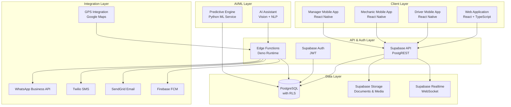
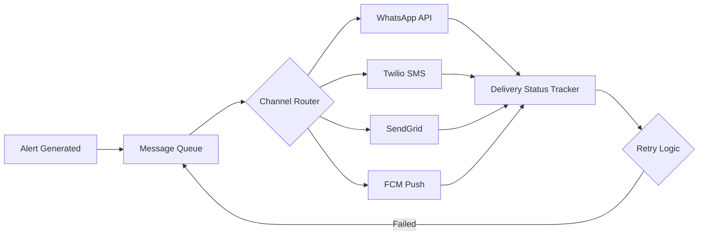
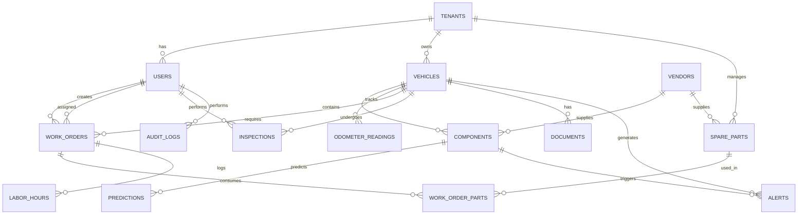

# Design Document

## Overview

FleetGuard AI is an enterprise-grade, multi-tenant SaaS platform that revolutionizes commercial fleet maintenance through predictive analytics and intelligent automation. The system combines traditional preventive maintenance tracking with AI/ML-powered predictive maintenance to minimize vehicle downtime and optimize maintenance costs.

### System Goals

1. **Proactive Maintenance**: Predict component failures before they occur using machine learning
2. **Multi-Tenant Isolation**: Ensure complete data security and privacy for each customer
3. **Real-Time Intelligence**: Provide instant insights and alerts across multiple channels
4. **Mobile-First Operation**: Enable drivers, mechanics, and managers to work efficiently from mobile devices
5. **Enterprise Scalability**: Support fleets from 10 to 10,000+ vehicles with consistent performance

### Key Capabilities

- **Component Lifecycle Tracking**: Monitor every critical component (tires, brakes, filters, batteries) throughout its lifecycle
- **Predictive Engine**: ML-based remaining useful life (RUL) estimation and failure probability scoring
- **Multi-Channel Notifications**: WhatsApp, SMS, Email, and Push notifications with intelligent routing
- **Offline-First Mobile Apps**: Android/iOS apps that work seamlessly without connectivity
- **Real-Time Dashboard**: Live updates using Supabase Realtime subscriptions
- **GPS Integration**: Real-time vehicle tracking and automated odometer updates
- **AI Maintenance Assistant**: Computer vision and NLP for automated work order creation
- **Comprehensive Analytics**: Executive dashboards with MTBF, MTTR, fleet health score, and cost analysis

### Technology Foundation

- **Database**: PostgreSQL via Supabase with Row-Level Security (RLS)
- **Authentication**: Supabase Auth with role-based access control
- **Storage**: Supabase Storage for documents and media
- **Real-Time**: Supabase Realtime for live dashboard updates
- **Mobile**: React Native (Expo) for cross-platform iOS/Android apps
- **Web Frontend**: React with TypeScript
- **Backend**: Supabase Edge Functions (Deno) for serverless compute
- **AI/ML**: Python-based predictive engine with scikit-learn/TensorFlow
- **Notifications**: WhatsApp Business API, Twilio (SMS), SendGrid (Email), Firebase Cloud Messaging (Push)


## Architecture

### High-Level Architecture



### Multi-Tenant Architecture

FleetGuard AI implements a **shared database with Row-Level Security (RLS)** model for multi-tenancy:

**Tenant Isolation Strategy:**
1. Every table includes a `tenant_id` column (UUID reference to `tenants` table)
2. PostgreSQL RLS policies enforce automatic filtering on all queries
3. Supabase Auth JWT contains `tenant_id` claim populated during login
4. All RLS policies reference `auth.jwt() ->> 'tenant_id'` for filtering

**Implementation Pattern:**
```sql
-- Example RLS policy for vehicles table
CREATE POLICY "Tenant isolation for vehicles"
ON vehicles
FOR ALL
USING (tenant_id = (auth.jwt() ->> 'tenant_id')::uuid);
```

This approach ensures:
- Zero trust: database enforces isolation even if application code has bugs
- Performance: PostgreSQL query planner optimizes RLS predicates efficiently
- Simplicity: no need for complex middleware or proxy layers
- Security: cross-tenant access is impossible at the database level

*References: [Supabase RLS Best Practices](https://makerkit.dev/blog/tutorials/supabase-rls-best-practices), [Production Patterns for Multi-Tenant Apps](https://designrevision.com/blog/supabase-row-level-security)*

### Scalability Architecture

**Horizontal Scalability:**
- Supabase automatically scales PostgreSQL with connection pooling (PgBouncer)
- Edge Functions scale automatically via serverless architecture
- Predictive Engine runs as containerized service with auto-scaling (ECS/Cloud Run)

**Performance Optimizations:**
- Database indexes on `tenant_id`, `vehicle_id`, `component_id`, `created_at`
- Materialized views for complex dashboard queries (refreshed every 5 minutes)
- Redis cache layer for frequently accessed data (fleet health scores, active alerts)
- CDN for static assets and mobile app bundles

**Concurrent User Support:**
- Target: 100 concurrent users per tenant
- Connection pooling limits: 25 connections per tenant (enforced by application layer)
- Rate limiting: 100 requests/minute per user via Edge Function middleware


## Components and Interfaces

### Frontend Components

#### Web Application (React + TypeScript)

**Pages:**
- **Dashboard**: Executive summary with fleet health score, active alerts, cost trends
- **Vehicles**: Vehicle list/detail views with lifecycle information
- **Components**: Component tracking per vehicle with wear patterns
- **Work Orders**: Workshop management with assignment and tracking
- **Inventory**: Spare parts catalog and stock management
- **Analytics**: Interactive charts with MTBF, MTTR, breakdown analysis
- **Documents**: Certificate management with expiry tracking
- **Settings**: Tenant configuration, user management, inspection checklists

**Key Libraries:**
- React Query for data fetching and caching
- Recharts for analytics visualization
- React Table for data grids
- React Router for navigation
- Zustand for global state management
- TailwindCSS for styling

**Real-Time Updates:**
```typescript
// Subscribe to alert changes
const subscription = supabase
  .channel('alerts')
  .on('postgres_changes', 
    { event: '*', schema: 'public', table: 'alerts' },
    (payload) => {
      // Update UI with new alert
      queryClient.invalidateQueries(['alerts']);
    }
  )
  .subscribe();
```

#### Mobile Applications (React Native + Expo)

**Driver App Features:**
- Daily inspection checklist with photo capture
- Defect reporting with severity selection
- Assigned vehicle and route information
- Offline-first architecture with background sync

**Mechanic App Features:**
- Assigned work orders with priority indication
- Photo/video/voice capture for maintenance records
- AI-assisted work order creation
- Parts consumption tracking
- Labor hour logging

**Manager App Features:**
- Fleet health dashboard
- Alert management with filtering
- Work order creation and assignment
- Cost summaries and analytics
- Push notification handling

**Offline-First Strategy:**
```typescript
// Local storage using WatermelonDB
const database = new Database({
  adapter: new SQLiteAdapter({
    schema: schema,
    migrations: migrations,
  }),
  modelClasses: [Vehicle, WorkOrder, Inspection],
});

// Background sync when online
NetInfo.addEventListener(state => {
  if (state.isConnected) {
    await syncEngine.sync();
  }
});
```

*References: [Offline-First React Native Guide](https://dev.family/blog/article/how-to-build-local-first-apps-with-react-native-rxdb-architecture-and-examples), [Local-First Architecture](https://metadesignsolutions.com/blog/implementing-offline-functionality-in-react-native-apps)*


### Backend Components

#### Supabase Edge Functions

Edge Functions handle business logic that requires server-side execution:

**Functions:**

1. **`alert-dispatcher`**: Routes alerts to appropriate notification channels
   - Input: `{ alert_id, user_ids[], channels[] }`
   - Output: `{ delivery_status: { channel: status }[] }`
   - Integrations: WhatsApp API, Twilio, SendGrid, FCM

2. **`odometer-validator`**: Validates and flags anomalous odometer readings
   - Input: `{ vehicle_id, reading, timestamp, source }`
   - Output: `{ valid: boolean, anomaly_flag: boolean, reason?: string }`
   - Logic: Check reading >= previous, flag if delta > 1000km in 24h

3. **`gps-processor`**: Processes GPS telemetry and updates vehicle state
   - Input: `{ device_id, lat, lon, speed, timestamp, odometer }`
   - Output: `{ updated: boolean }`
   - Updates: vehicle location, odometer, GPS history

4. **`maintenance-scheduler`**: Generates due/overdue alerts based on schedules
   - Trigger: Cron (daily at 2:00 AM)
   - Logic: Calculate due dates/odometer for all components, create alerts

5. **`ai-assistant-handler`**: Processes photos/videos/voice for work orders
   - Input: `{ file_url, type: 'photo'|'video'|'voice', work_order_id }`
   - Output: `{ component_type, damage_type, severity, description }`
   - Integration: Computer vision API, speech-to-text API, LLM API

6. **`subscription-enforcer`**: Enforces subscription limits and features
   - Trigger: Before vehicle creation, feature access
   - Logic: Check tenant vehicle count vs plan limit

#### Predictive Maintenance Engine (Python Service)

**Architecture:**
- Containerized Python service (FastAPI)
- Deployed as long-running service (not serverless due to model loading overhead)
- Connects to PostgreSQL for training data and prediction storage
- Scheduled job: retrain models weekly, run predictions daily

**ML Pipeline:**

```python
# Prediction workflow
class PredictiveEngine:
    def predict_failures(self, tenant_id: str):
        # 1. Extract features
        vehicles = get_vehicles_with_history(tenant_id)
        features = extract_features(vehicles)
        
        # 2. Predict failure probability
        failure_prob = model.predict_proba(features)
        
        # 3. Calculate remaining useful life
        rul = estimate_rul(features, failure_prob)
        
        # 4. Assign risk score
        risk_score = calculate_risk(failure_prob, rul)
        
        # 5. Store predictions
        save_predictions(tenant_id, predictions)
        
        # 6. Generate high-risk alerts
        create_alerts(predictions.filter(risk >= HIGH))
```

**Feature Engineering:**
- Component age (days since installation)
- Usage intensity (km per day average)
- Historical failure count for component type
- Maintenance frequency compliance rate
- Vehicle route type (urban vs highway)
- Seasonal factors (weather patterns)

**Model Selection:**
- Survival Analysis (Weibull distribution) for RUL estimation
- Random Forest Classifier for failure probability
- Gradient Boosting for risk scoring
- Models trained per component category (tires, brakes, filters, etc.)

*References: [Predictive Maintenance Analytics](https://tractian.com/en/blog/predictive-maintenance-analytics), [ML for Predictive Maintenance](https://www.neuralconcept.com/post/predictive-maintenance-algorithms-for-better-efficiency)*


### Integration Components

#### Multi-Channel Notification System

**Architecture Pattern:**


**Implementation:**
```typescript
// Alert dispatcher logic
async function dispatchAlert(alert: Alert, users: User[]) {
  for (const user of users) {
    const channels = user.notification_preferences[alert.type] || ['email'];
    
    for (const channel of channels) {
      const job = {
        alert_id: alert.id,
        user_id: user.id,
        channel: channel,
        attempt: 1,
      };
      
      await messageQueue.enqueue(job);
    }
  }
}

// Channel-specific handlers
const handlers = {
  whatsapp: async (job) => {
    const response = await whatsappAPI.sendTemplate({
      to: job.user.phone,
      template: 'alert_notification',
      params: [job.alert.vehicle, job.alert.description],
    });
    return response.status;
  },
  sms: async (job) => {
    const response = await twilio.messages.create({
      to: job.user.phone,
      body: formatAlertMessage(job.alert),
    });
    return response.status;
  },
  email: async (job) => {
    const response = await sendgrid.send({
      to: job.user.email,
      template_id: 'alert_template',
      dynamic_data: job.alert,
    });
    return response.status;
  },
  push: async (job) => {
    const response = await fcm.send({
      token: job.user.fcm_token,
      notification: {
        title: job.alert.title,
        body: job.alert.description,
      },
    });
    return response.status;
  },
};
```

**Retry Strategy:**
- Max 3 retry attempts per message
- Exponential backoff: 1 min, 5 min, 15 min
- Failed messages logged for manual review
- Escalation for critical alerts: if not acknowledged in 2 hours, send to Fleet Manager

*References: [Multi-Channel Notification Architecture](https://www.suprsend.com/post/multi-channel-notifications), [Scalable WhatsApp Notification System](https://wasenderapi.com/blog/how-to-build-a-scalable-whatsapp-notification-system-for-saas-architecture-guide)*

#### GPS Integration

**Data Flow:**
1. GPS device transmits telemetry every 15 minutes via API webhook
2. `gps-processor` Edge Function receives webhook payload
3. Validate device_id against registered vehicles
4. Update vehicle location in PostgreSQL
5. Calculate distance delta and update odometer
6. Store GPS history for route replay
7. Validate odometer against previous readings (anomaly detection)

**GPS Data Schema:**
```typescript
interface GPSTelemetry {
  device_id: string;
  timestamp: string;
  latitude: number;
  longitude: number;
  speed: number; // km/h
  heading: number; // degrees
  odometer?: number; // if device provides it
  ignition_status: 'on' | 'off';
}
```

**Google Maps Integration:**
- Display vehicle markers on map with clustering for large fleets
- Route history visualization with polyline drawing
- Geocoding for address display
- Distance matrix API for route optimization (future enhancement)


## Data Models

### Core Entities

#### Tenants
```sql
CREATE TABLE tenants (
  id UUID PRIMARY KEY DEFAULT gen_random_uuid(),
  name TEXT NOT NULL,
  subscription_plan TEXT NOT NULL CHECK (subscription_plan IN ('starter', 'professional', 'enterprise')),
  vehicle_limit INTEGER NOT NULL,
  subscription_status TEXT NOT NULL CHECK (subscription_status IN ('active', 'suspended', 'cancelled')),
  billing_cycle TEXT NOT NULL CHECK (billing_cycle IN ('monthly', 'annual')),
  next_billing_date DATE NOT NULL,
  created_at TIMESTAMPTZ NOT NULL DEFAULT NOW(),
  updated_at TIMESTAMPTZ NOT NULL DEFAULT NOW()
);

CREATE INDEX idx_tenants_subscription_status ON tenants(subscription_status);
```

#### Users
```sql
CREATE TABLE users (
  id UUID PRIMARY KEY REFERENCES auth.users(id),
  tenant_id UUID NOT NULL REFERENCES tenants(id) ON DELETE CASCADE,
  email TEXT NOT NULL,
  full_name TEXT NOT NULL,
  role TEXT NOT NULL CHECK (role IN (
    'super_admin', 'company_owner', 'fleet_manager', 'workshop_manager',
    'maintenance_engineer', 'mechanic', 'driver', 'inspector', 'accountant', 'auditor'
  )),
  phone TEXT,
  fcm_token TEXT, -- for push notifications
  notification_preferences JSONB NOT NULL DEFAULT '{}',
  theme TEXT NOT NULL DEFAULT 'light' CHECK (theme IN ('light', 'dark')),
  locale TEXT NOT NULL DEFAULT 'en',
  created_at TIMESTAMPTZ NOT NULL DEFAULT NOW(),
  updated_at TIMESTAMPTZ NOT NULL DEFAULT NOW()
);

CREATE INDEX idx_users_tenant_id ON users(tenant_id);
CREATE INDEX idx_users_role ON users(role);

-- RLS Policy
CREATE POLICY "Tenant isolation for users"
ON users FOR ALL
USING (tenant_id = (auth.jwt() ->> 'tenant_id')::uuid);
```

#### Vehicles
```sql
CREATE TABLE vehicles (
  id UUID PRIMARY KEY DEFAULT gen_random_uuid(),
  tenant_id UUID NOT NULL REFERENCES tenants(id) ON DELETE CASCADE,
  vin TEXT NOT NULL,
  chassis_number TEXT,
  engine_number TEXT,
  make TEXT NOT NULL,
  model TEXT NOT NULL,
  year INTEGER NOT NULL,
  vehicle_type TEXT NOT NULL CHECK (vehicle_type IN ('bus', 'truck', 'van', 'construction', 'custom')),
  current_odometer INTEGER NOT NULL DEFAULT 0, -- in kilometers
  unit TEXT NOT NULL DEFAULT 'km' CHECK (unit IN ('km', 'miles')),
  gps_device_id TEXT,
  assigned_route TEXT,
  depot_location TEXT,
  assigned_driver_id UUID REFERENCES users(id),
  status TEXT NOT NULL DEFAULT 'active' CHECK (status IN ('active', 'maintenance', 'retired')),
  last_gps_update TIMESTAMPTZ,
  last_location POINT, -- PostGIS geography
  created_at TIMESTAMPTZ NOT NULL DEFAULT NOW(),
  updated_at TIMESTAMPTZ NOT NULL DEFAULT NOW(),
  UNIQUE(tenant_id, vin)
);

CREATE INDEX idx_vehicles_tenant_id ON vehicles(tenant_id);
CREATE INDEX idx_vehicles_status ON vehicles(status);
CREATE INDEX idx_vehicles_gps_device_id ON vehicles(gps_device_id);

-- RLS Policy
CREATE POLICY "Tenant isolation for vehicles"
ON vehicles FOR ALL
USING (tenant_id = (auth.jwt() ->> 'tenant_id')::uuid);
```

#### Components
```sql
CREATE TABLE components (
  id UUID PRIMARY KEY DEFAULT gen_random_uuid(),
  tenant_id UUID NOT NULL REFERENCES tenants(id) ON DELETE CASCADE,
  vehicle_id UUID NOT NULL REFERENCES vehicles(id) ON DELETE CASCADE,
  component_type TEXT NOT NULL, -- 'tire', 'brake', 'oil', 'filter', 'battery', etc.
  component_subtype TEXT, -- e.g., 'front_left_tire', 'engine_oil', etc.
  brand TEXT,
  model TEXT,
  serial_number TEXT,
  installation_date DATE NOT NULL,
  installation_odometer INTEGER NOT NULL,
  vendor_id UUID REFERENCES vendors(id),
  cost DECIMAL(10, 2),
  warranty_period_days INTEGER,
  expected_life_days INTEGER,
  expected_life_km INTEGER,
  inspection_frequency_days INTEGER,
  maintenance_frequency_km INTEGER,
  status TEXT NOT NULL DEFAULT 'active' CHECK (status IN ('active', 'replaced', 'removed')),
  created_at TIMESTAMPTZ NOT NULL DEFAULT NOW(),
  updated_at TIMESTAMPTZ NOT NULL DEFAULT NOW()
);

CREATE INDEX idx_components_tenant_id ON components(tenant_id);
CREATE INDEX idx_components_vehicle_id ON components(vehicle_id);
CREATE INDEX idx_components_type ON components(component_type);
CREATE INDEX idx_components_status ON components(status);

-- RLS Policy
CREATE POLICY "Tenant isolation for components"
ON components FOR ALL
USING (tenant_id = (auth.jwt() ->> 'tenant_id')::uuid);
```


#### Odometer Readings
```sql
CREATE TABLE odometer_readings (
  id UUID PRIMARY KEY DEFAULT gen_random_uuid(),
  tenant_id UUID NOT NULL REFERENCES tenants(id) ON DELETE CASCADE,
  vehicle_id UUID NOT NULL REFERENCES vehicles(id) ON DELETE CASCADE,
  reading INTEGER NOT NULL,
  timestamp TIMESTAMPTZ NOT NULL DEFAULT NOW(),
  source TEXT NOT NULL CHECK (source IN ('manual', 'excel', 'bulk', 'gps', 'api')),
  submitted_by UUID REFERENCES users(id),
  is_anomalous BOOLEAN NOT NULL DEFAULT FALSE,
  anomaly_reason TEXT,
  confirmed BOOLEAN NOT NULL DEFAULT TRUE,
  created_at TIMESTAMPTZ NOT NULL DEFAULT NOW()
);

CREATE INDEX idx_odometer_tenant_id ON odometer_readings(tenant_id);
CREATE INDEX idx_odometer_vehicle_id ON odometer_readings(vehicle_id);
CREATE INDEX idx_odometer_timestamp ON odometer_readings(timestamp DESC);

-- RLS Policy
CREATE POLICY "Tenant isolation for odometer_readings"
ON odometer_readings FOR ALL
USING (tenant_id = (auth.jwt() ->> 'tenant_id')::uuid);
```

#### Work Orders
```sql
CREATE TABLE work_orders (
  id UUID PRIMARY KEY DEFAULT gen_random_uuid(),
  tenant_id UUID NOT NULL REFERENCES tenants(id) ON DELETE CASCADE,
  work_order_number TEXT NOT NULL,
  vehicle_id UUID NOT NULL REFERENCES vehicles(id) ON DELETE CASCADE,
  description TEXT NOT NULL,
  priority TEXT NOT NULL CHECK (priority IN ('low', 'medium', 'high', 'critical')),
  status TEXT NOT NULL DEFAULT 'pending' CHECK (status IN ('pending', 'assigned', 'in_progress', 'completed', 'cancelled')),
  requested_by UUID NOT NULL REFERENCES users(id),
  assigned_to UUID REFERENCES users(id),
  started_at TIMESTAMPTZ,
  completed_at TIMESTAMPTZ,
  total_labor_hours DECIMAL(5, 2) DEFAULT 0,
  total_parts_cost DECIMAL(10, 2) DEFAULT 0,
  total_labor_cost DECIMAL(10, 2) DEFAULT 0,
  total_cost DECIMAL(10, 2) DEFAULT 0,
  service_report TEXT,
  created_at TIMESTAMPTZ NOT NULL DEFAULT NOW(),
  updated_at TIMESTAMPTZ NOT NULL DEFAULT NOW(),
  UNIQUE(tenant_id, work_order_number)
);

CREATE INDEX idx_work_orders_tenant_id ON work_orders(tenant_id);
CREATE INDEX idx_work_orders_vehicle_id ON work_orders(vehicle_id);
CREATE INDEX idx_work_orders_status ON work_orders(status);
CREATE INDEX idx_work_orders_assigned_to ON work_orders(assigned_to);

-- RLS Policy
CREATE POLICY "Tenant isolation for work_orders"
ON work_orders FOR ALL
USING (tenant_id = (auth.jwt() ->> 'tenant_id')::uuid);
```

#### Alerts
```sql
CREATE TABLE alerts (
  id UUID PRIMARY KEY DEFAULT gen_random_uuid(),
  tenant_id UUID NOT NULL REFERENCES tenants(id) ON DELETE CASCADE,
  vehicle_id UUID REFERENCES vehicles(id) ON DELETE CASCADE,
  component_id UUID REFERENCES components(id) ON DELETE CASCADE,
  alert_type TEXT NOT NULL CHECK (alert_type IN (
    'due_soon', 'overdue', 'critical_failure_risk', 'safety_risk', 
    'low_stock', 'document_expiry', 'document_expired', 'tire_replacement_forecast'
  )),
  severity TEXT NOT NULL CHECK (severity IN ('low', 'medium', 'high', 'critical')),
  title TEXT NOT NULL,
  description TEXT NOT NULL,
  status TEXT NOT NULL DEFAULT 'active' CHECK (status IN ('active', 'acknowledged', 'resolved')),
  acknowledged_by UUID REFERENCES users(id),
  acknowledged_at TIMESTAMPTZ,
  resolved_at TIMESTAMPTZ,
  created_at TIMESTAMPTZ NOT NULL DEFAULT NOW(),
  updated_at TIMESTAMPTZ NOT NULL DEFAULT NOW()
);

CREATE INDEX idx_alerts_tenant_id ON alerts(tenant_id);
CREATE INDEX idx_alerts_vehicle_id ON alerts(vehicle_id);
CREATE INDEX idx_alerts_status ON alerts(status);
CREATE INDEX idx_alerts_severity ON alerts(severity);
CREATE INDEX idx_alerts_created_at ON alerts(created_at DESC);

-- RLS Policy
CREATE POLICY "Tenant isolation for alerts"
ON alerts FOR ALL
USING (tenant_id = (auth.jwt() ->> 'tenant_id')::uuid);
```


#### Predictions (ML Outputs)
```sql
CREATE TABLE predictions (
  id UUID PRIMARY KEY DEFAULT gen_random_uuid(),
  tenant_id UUID NOT NULL REFERENCES tenants(id) ON DELETE CASCADE,
  vehicle_id UUID NOT NULL REFERENCES vehicles(id) ON DELETE CASCADE,
  component_id UUID NOT NULL REFERENCES components(id) ON DELETE CASCADE,
  prediction_date DATE NOT NULL,
  failure_probability DECIMAL(5, 4) NOT NULL CHECK (failure_probability BETWEEN 0 AND 1),
  risk_score TEXT NOT NULL CHECK (risk_score IN ('low', 'medium', 'high', 'critical')),
  remaining_useful_life_days INTEGER,
  remaining_useful_life_km INTEGER,
  recommended_action TEXT,
  model_version TEXT NOT NULL,
  created_at TIMESTAMPTZ NOT NULL DEFAULT NOW()
);

CREATE INDEX idx_predictions_tenant_id ON predictions(tenant_id);
CREATE INDEX idx_predictions_component_id ON predictions(component_id);
CREATE INDEX idx_predictions_risk_score ON predictions(risk_score);
CREATE INDEX idx_predictions_date ON predictions(prediction_date DESC);

-- RLS Policy
CREATE POLICY "Tenant isolation for predictions"
ON predictions FOR ALL
USING (tenant_id = (auth.jwt() ->> 'tenant_id')::uuid);
```

#### Spare Parts
```sql
CREATE TABLE spare_parts (
  id UUID PRIMARY KEY DEFAULT gen_random_uuid(),
  tenant_id UUID NOT NULL REFERENCES tenants(id) ON DELETE CASCADE,
  part_number TEXT NOT NULL,
  description TEXT NOT NULL,
  category TEXT NOT NULL,
  unit_of_measure TEXT NOT NULL,
  unit_cost DECIMAL(10, 2) NOT NULL,
  current_quantity INTEGER NOT NULL DEFAULT 0,
  reorder_level INTEGER NOT NULL DEFAULT 0,
  max_stock_level INTEGER,
  vendor_id UUID REFERENCES vendors(id),
  created_at TIMESTAMPTZ NOT NULL DEFAULT NOW(),
  updated_at TIMESTAMPTZ NOT NULL DEFAULT NOW(),
  UNIQUE(tenant_id, part_number)
);

CREATE INDEX idx_spare_parts_tenant_id ON spare_parts(tenant_id);
CREATE INDEX idx_spare_parts_category ON spare_parts(category);

-- RLS Policy
CREATE POLICY "Tenant isolation for spare_parts"
ON spare_parts FOR ALL
USING (tenant_id = (auth.jwt() ->> 'tenant_id')::uuid);
```

#### Documents
```sql
CREATE TABLE documents (
  id UUID PRIMARY KEY DEFAULT gen_random_uuid(),
  tenant_id UUID NOT NULL REFERENCES tenants(id) ON DELETE CASCADE,
  vehicle_id UUID REFERENCES vehicles(id) ON DELETE CASCADE,
  document_type TEXT NOT NULL CHECK (document_type IN (
    'insurance', 'rc_book', 'fitness_certificate', 'pollution_certificate', 
    'invoice', 'warranty', 'service_report'
  )),
  file_name TEXT NOT NULL,
  file_url TEXT NOT NULL, -- Supabase Storage URL
  file_size INTEGER NOT NULL, -- bytes
  expiry_date DATE,
  uploaded_by UUID NOT NULL REFERENCES users(id),
  created_at TIMESTAMPTZ NOT NULL DEFAULT NOW()
);

CREATE INDEX idx_documents_tenant_id ON documents(tenant_id);
CREATE INDEX idx_documents_vehicle_id ON documents(vehicle_id);
CREATE INDEX idx_documents_expiry_date ON documents(expiry_date);

-- RLS Policy
CREATE POLICY "Tenant isolation for documents"
ON documents FOR ALL
USING (tenant_id = (auth.jwt() ->> 'tenant_id')::uuid);
```

#### Inspections
```sql
CREATE TABLE inspections (
  id UUID PRIMARY KEY DEFAULT gen_random_uuid(),
  tenant_id UUID NOT NULL REFERENCES tenants(id) ON DELETE CASCADE,
  vehicle_id UUID NOT NULL REFERENCES vehicles(id) ON DELETE CASCADE,
  inspector_id UUID NOT NULL REFERENCES users(id),
  checklist_id UUID NOT NULL REFERENCES inspection_checklists(id),
  inspection_date TIMESTAMPTZ NOT NULL DEFAULT NOW(),
  odometer_reading INTEGER NOT NULL,
  overall_status TEXT NOT NULL CHECK (overall_status IN ('pass', 'fail', 'warning')),
  checklist_results JSONB NOT NULL, -- array of { item_id, result, notes, photo_urls }
  defects_reported INTEGER NOT NULL DEFAULT 0,
  created_at TIMESTAMPTZ NOT NULL DEFAULT NOW()
);

CREATE INDEX idx_inspections_tenant_id ON inspections(tenant_id);
CREATE INDEX idx_inspections_vehicle_id ON inspections(vehicle_id);
CREATE INDEX idx_inspections_date ON inspections(inspection_date DESC);

-- RLS Policy
CREATE POLICY "Tenant isolation for inspections"
ON inspections FOR ALL
USING (tenant_id = (auth.jwt() ->> 'tenant_id')::uuid);
```


#### Audit Logs
```sql
CREATE TABLE audit_logs (
  id UUID PRIMARY KEY DEFAULT gen_random_uuid(),
  tenant_id UUID NOT NULL REFERENCES tenants(id) ON DELETE CASCADE,
  user_id UUID NOT NULL REFERENCES users(id),
  operation TEXT NOT NULL CHECK (operation IN ('create', 'update', 'delete')),
  entity_type TEXT NOT NULL,
  entity_id UUID NOT NULL,
  changed_fields JSONB, -- { field_name: { old_value, new_value } }
  timestamp TIMESTAMPTZ NOT NULL DEFAULT NOW()
);

CREATE INDEX idx_audit_logs_tenant_id ON audit_logs(tenant_id);
CREATE INDEX idx_audit_logs_user_id ON audit_logs(user_id);
CREATE INDEX idx_audit_logs_entity_type ON audit_logs(entity_type);
CREATE INDEX idx_audit_logs_timestamp ON audit_logs(timestamp DESC);

-- RLS Policy (read-only access, no updates/deletes)
CREATE POLICY "Tenant isolation for audit_logs"
ON audit_logs FOR SELECT
USING (tenant_id = (auth.jwt() ->> 'tenant_id')::uuid);

-- Prevent any modifications to audit logs
CREATE POLICY "No modifications to audit_logs"
ON audit_logs FOR UPDATE
USING (FALSE);

CREATE POLICY "No deletions from audit_logs"
ON audit_logs FOR DELETE
USING (FALSE);
```

### Relationships



### Calculated Fields and Views

**Fleet Health Score View:**
```sql
CREATE MATERIALIZED VIEW fleet_health_scores AS
SELECT 
  tenant_id,
  vehicle_id,
  (100 - AVG(
    CASE 
      WHEN p.risk_score = 'critical' THEN 40
      WHEN p.risk_score = 'high' THEN 25
      WHEN p.risk_score = 'medium' THEN 10
      ELSE 0
    END
  ))::INTEGER AS health_score,
  COUNT(CASE WHEN p.risk_score IN ('high', 'critical') THEN 1 END) AS high_risk_components,
  NOW() AS last_updated
FROM predictions p
WHERE p.prediction_date = CURRENT_DATE
GROUP BY tenant_id, vehicle_id;

CREATE UNIQUE INDEX idx_fleet_health_tenant_vehicle ON fleet_health_scores(tenant_id, vehicle_id);
CREATE INDEX idx_fleet_health_tenant ON fleet_health_scores(tenant_id);

-- Refresh every 5 minutes via cron job
```

**Cost Summary View:**
```sql
CREATE VIEW cost_summary AS
SELECT
  wo.tenant_id,
  wo.vehicle_id,
  DATE_TRUNC('month', wo.completed_at) AS month,
  SUM(wo.total_parts_cost) AS total_parts_cost,
  SUM(wo.total_labor_cost) AS total_labor_cost,
  SUM(wo.total_cost) AS total_cost,
  COUNT(*) AS work_order_count
FROM work_orders wo
WHERE wo.status = 'completed'
GROUP BY wo.tenant_id, wo.vehicle_id, DATE_TRUNC('month', wo.completed_at);
```


## Error Handling

### Client-Side Error Handling

**Web Application:**
```typescript
// Global error boundary
class ErrorBoundary extends React.Component {
  componentDidCatch(error: Error, errorInfo: React.ErrorInfo) {
    // Log to monitoring service
    logger.error('React error boundary caught:', { error, errorInfo });
    
    // Show user-friendly error message
    toast.error('Something went wrong. Please refresh the page.');
  }
}

// API error handling
const handleAPIError = (error: SupabaseError) => {
  if (error.code === 'PGRST116') {
    // RLS policy violation
    toast.error('You do not have permission to access this resource');
  } else if (error.code === '23505') {
    // Unique constraint violation
    toast.error('This record already exists');
  } else if (error.message.includes('JWT')) {
    // Auth token expired
    router.push('/login');
  } else {
    toast.error('An error occurred. Please try again.');
  }
  
  // Log for debugging
  logger.error('API error:', error);
};
```

**Mobile Application:**
```typescript
// Offline error handling
const syncWithRetry = async (maxRetries = 3) => {
  for (let attempt = 1; attempt <= maxRetries; attempt++) {
    try {
      await syncEngine.sync();
      return { success: true };
    } catch (error) {
      if (attempt === maxRetries) {
        Alert.alert(
          'Sync Failed',
          'Unable to sync data. Changes are saved locally and will sync when connection is restored.'
        );
        return { success: false, error };
      }
      await new Promise(resolve => setTimeout(resolve, 1000 * attempt));
    }
  }
};

// Photo upload error handling
const uploadPhotoWithFallback = async (photo: Photo) => {
  try {
    // Compress image before upload
    const compressed = await compressImage(photo, { quality: 0.7 });
    return await supabase.storage.from('photos').upload(compressed);
  } catch (error) {
    // Store locally for retry
    await localDB.queue.add({ type: 'photo_upload', data: photo });
    toast.show('Photo queued for upload when online');
  }
};
```

### Backend Error Handling

**Edge Functions:**
```typescript
// Standard error response format
interface ErrorResponse {
  error: {
    code: string;
    message: string;
    details?: any;
  };
}

// Centralized error handler
const handleError = (error: Error): Response => {
  if (error instanceof ValidationError) {
    return new Response(
      JSON.stringify({
        error: {
          code: 'VALIDATION_ERROR',
          message: error.message,
          details: error.fields,
        },
      }),
      { status: 400 }
    );
  }
  
  if (error instanceof UnauthorizedError) {
    return new Response(
      JSON.stringify({
        error: {
          code: 'UNAUTHORIZED',
          message: 'Invalid credentials or expired token',
        },
      }),
      { status: 401 }
    );
  }
  
  // Log unexpected errors
  console.error('Unexpected error:', error);
  
  return new Response(
    JSON.stringify({
      error: {
        code: 'INTERNAL_ERROR',
        message: 'An internal error occurred',
      },
    }),
    { status: 500 }
  );
};

// Rate limiting errors
const checkRateLimit = async (userId: string) => {
  const count = await redis.incr(`rate_limit:${userId}`);
  if (count === 1) {
    await redis.expire(`rate_limit:${userId}`, 60);
  }
  
  if (count > 100) {
    throw new RateLimitError('Too many requests. Please try again later.');
  }
};
```


**Predictive Engine Error Handling:**
```python
# ML service error handling
class PredictiveEngineError(Exception):
    """Base exception for predictive engine"""
    pass

class ModelNotFoundError(PredictiveEngineError):
    """Raised when ML model files are missing"""
    pass

class InsufficientDataError(PredictiveEngineError):
    """Raised when not enough data for predictions"""
    pass

async def predict_with_fallback(tenant_id: str):
    try:
        # Attempt prediction with latest model
        predictions = await predict_failures(tenant_id, model_version='latest')
        return predictions
    except ModelNotFoundError:
        logger.error(f'Model not found for tenant {tenant_id}')
        # Fall back to rule-based predictions
        return rule_based_predictions(tenant_id)
    except InsufficientDataError as e:
        logger.warning(f'Insufficient data for tenant {tenant_id}: {e}')
        # Return empty predictions with warning
        return {'predictions': [], 'warning': 'Insufficient data for ML predictions'}
    except Exception as e:
        logger.error(f'Prediction failed for tenant {tenant_id}: {e}')
        # Alert admins for manual review
        await alert_admin(tenant_id, error=str(e))
        raise
```

**Notification Error Handling:**
```typescript
// Channel-specific error handling
const sendWithFallback = async (alert: Alert, user: User) => {
  const preferredChannels = user.notification_preferences[alert.type];
  
  for (const channel of preferredChannels) {
    try {
      await sendNotification(channel, alert, user);
      // Log successful delivery
      await logDelivery(alert.id, user.id, channel, 'delivered');
      return { success: true, channel };
    } catch (error) {
      // Log failed delivery
      await logDelivery(alert.id, user.id, channel, 'failed', error.message);
      
      // Try next channel
      continue;
    }
  }
  
  // All channels failed - send to fallback (email)
  try {
    await sendEmail(user.email, formatAlertEmail(alert));
    await logDelivery(alert.id, user.id, 'email_fallback', 'delivered');
  } catch (error) {
    // Queue for manual review
    await queueFailedNotification(alert, user, error);
  }
};
```

### Database Error Handling

**Transaction Management:**
```sql
-- Example: Work order completion with parts deduction
BEGIN;
  -- Update work order status
  UPDATE work_orders 
  SET status = 'completed', completed_at = NOW()
  WHERE id = $1 AND tenant_id = $2;
  
  -- Deduct parts from inventory
  UPDATE spare_parts
  SET current_quantity = current_quantity - $3
  WHERE id = $4 AND tenant_id = $2;
  
  -- Check if inventory went negative (constraint violation)
  IF (SELECT current_quantity FROM spare_parts WHERE id = $4) < 0 THEN
    ROLLBACK;
    RAISE EXCEPTION 'Insufficient inventory for part %', $4;
  END IF;
  
COMMIT;
```

**Connection Pool Management:**
```typescript
// Handle connection pool exhaustion
const executeWithRetry = async (query: string, params: any[]) => {
  const maxRetries = 3;
  let lastError;
  
  for (let i = 0; i < maxRetries; i++) {
    try {
      return await supabase.rpc(query, params);
    } catch (error) {
      if (error.code === '53300') {
        // Connection pool exhausted
        logger.warn('Connection pool exhausted, retrying...');
        await sleep(500 * (i + 1));
        lastError = error;
      } else {
        throw error;
      }
    }
  }
  
  throw lastError;
};
```

### Graceful Degradation

**Dashboard Load Failure:**
- If real-time connection fails: show cached data with "Last updated" timestamp
- If analytics query times out: show simplified metrics with option to retry
- If Fleet Health Score calculation fails: show individual vehicle statuses instead

**Mobile Offline Mode:**
- All core features work offline (inspections, work orders, defect reporting)
- Queue operations for sync when online
- Show sync status indicator in header
- Allow user to manually trigger sync

**GPS Integration Failure:**
- If GPS device stops transmitting: show last known location with timestamp
- If GPS data is invalid: flag for manual review, don't update odometer
- If geocoding fails: show coordinates instead of address


## Testing Strategy

### Testing Approach

FleetGuard AI requires a comprehensive testing strategy covering multiple layers:

1. **Unit Tests**: Test individual functions and components in isolation
2. **Integration Tests**: Test interactions between services and external APIs
3. **End-to-End Tests**: Test complete user workflows
4. **Performance Tests**: Validate system performance under load
5. **Security Tests**: Verify authentication, authorization, and data isolation

**Note on Property-Based Testing:**
Property-based testing (PBT) is **not applicable** for FleetGuard AI because:
- The system is primarily infrastructure and integration code (database, external APIs, UI)
- Core functionality involves side effects (database writes, API calls, notifications)
- Business logic is deterministic CRUD operations rather than pure functions with complex invariants
- External service behavior (GPS, ML models, WhatsApp API) cannot be verified with generative testing

Instead, we use **example-based unit tests** with representative scenarios and **integration tests** with real/mocked external services.

### Unit Testing

**Frontend (React Components):**
```typescript
// Jest + React Testing Library
describe('VehicleList', () => {
  it('should display vehicles from the tenant', async () => {
    const mockVehicles = [
      { id: '1', vin: 'ABC123', make: 'Volvo', model: 'B7R', status: 'active' }
    ];
    
    jest.spyOn(supabase, 'from').mockReturnValue({
      select: jest.fn().mockResolvedValue({ data: mockVehicles, error: null })
    });
    
    render(<VehicleList />);
    
    expect(await screen.findByText('ABC123')).toBeInTheDocument();
    expect(screen.getByText('Volvo B7R')).toBeInTheDocument();
  });
  
  it('should handle error state gracefully', async () => {
    jest.spyOn(supabase, 'from').mockReturnValue({
      select: jest.fn().mockResolvedValue({ 
        data: null, 
        error: { message: 'Network error' } 
      })
    });
    
    render(<VehicleList />);
    
    expect(await screen.findByText(/error loading vehicles/i)).toBeInTheDocument();
  });
});
```

**Backend (Edge Functions):**
```typescript
// Deno test
Deno.test('odometer-validator validates increasing readings', async () => {
  const input = {
    vehicle_id: 'test-vehicle-id',
    reading: 50000,
    timestamp: new Date().toISOString(),
    source: 'manual',
  };
  
  // Mock previous reading
  const mockDB = {
    getPreviousReading: () => Promise.resolve({ reading: 49000 }),
  };
  
  const result = await validateOdometer(input, mockDB);
  
  assertEquals(result.valid, true);
  assertEquals(result.anomaly_flag, false);
});

Deno.test('odometer-validator flags large jumps', async () => {
  const input = {
    vehicle_id: 'test-vehicle-id',
    reading: 51500,
    timestamp: new Date().toISOString(),
    source: 'manual',
  };
  
  const mockDB = {
    getPreviousReading: () => Promise.resolve({ 
      reading: 50000, 
      timestamp: new Date(Date.now() - 2 * 3600 * 1000).toISOString() // 2 hours ago
    }),
  };
  
  const result = await validateOdometer(input, mockDB);
  
  assertEquals(result.valid, true);
  assertEquals(result.anomaly_flag, true);
  assertEquals(result.reason, 'Reading increased by 1500 km in 2 hours');
});
```

**ML Service (Python):**
```python
# pytest
def test_feature_extraction():
    vehicle_data = {
        'installation_date': '2023-01-01',
        'installation_odometer': 10000,
        'current_odometer': 50000,
        'failure_history': [
            {'component_type': 'tire', 'failure_date': '2023-06-01'}
        ],
        'route_type': 'highway',
    }
    
    features = extract_features(vehicle_data)
    
    assert 'component_age_days' in features
    assert 'usage_intensity_km_per_day' in features
    assert 'failure_count' in features
    assert features['usage_intensity_km_per_day'] > 0

def test_risk_score_calculation():
    prediction = {
        'failure_probability': 0.85,
        'remaining_useful_life_days': 5,
    }
    
    risk_score = calculate_risk(prediction)
    
    assert risk_score == 'critical'
```


### Integration Testing

**Database + RLS Policies:**
```typescript
// Test tenant isolation
describe('RLS Policies', () => {
  it('should prevent cross-tenant data access', async () => {
    // Create two tenants
    const tenant1 = await createTestTenant('Tenant 1');
    const tenant2 = await createTestTenant('Tenant 2');
    
    // Create vehicle for tenant1
    const vehicle = await createVehicle({
      tenant_id: tenant1.id,
      vin: 'TEST123',
      make: 'Volvo',
    });
    
    // Try to access from tenant2 context
    const { data, error } = await supabase
      .from('vehicles')
      .select('*')
      .eq('id', vehicle.id)
      .auth(tenant2.user.jwt); // Use tenant2 JWT
    
    expect(data).toEqual([]); // Should return empty
    expect(error).toBeNull(); // RLS filters silently
  });
});
```

**Notification Channels:**
```typescript
// Test WhatsApp integration
describe('WhatsApp Notification', () => {
  it('should send alert via WhatsApp API', async () => {
    const mockAPI = nock('https://api.whatsapp.com')
      .post('/v1/messages')
      .reply(200, { message_id: 'wamid.123', status: 'sent' });
    
    const alert = {
      title: 'Brake Maintenance Due',
      description: 'Vehicle ABC123 brake pads need replacement',
    };
    
    const user = {
      phone: '+15551234567',
    };
    
    const result = await sendWhatsAppNotification(alert, user);
    
    expect(result.status).toBe('delivered');
    expect(mockAPI.isDone()).toBe(true);
  });
  
  it('should retry on temporary failure', async () => {
    let attempt = 0;
    const mockAPI = nock('https://api.whatsapp.com')
      .post('/v1/messages')
      .times(3)
      .reply(() => {
        attempt++;
        return attempt < 3 ? [500, 'Server error'] : [200, { message_id: 'wamid.456' }];
      });
    
    const result = await sendWhatsAppNotification(alert, user);
    
    expect(result.status).toBe('delivered');
    expect(result.attempts).toBe(3);
  });
});
```

**GPS Integration:**
```typescript
describe('GPS Processor', () => {
  it('should update vehicle location from GPS telemetry', async () => {
    const vehicle = await createTestVehicle({ gps_device_id: 'GPS123' });
    
    const telemetry = {
      device_id: 'GPS123',
      latitude: 12.9716,
      longitude: 77.5946,
      speed: 45,
      timestamp: new Date().toISOString(),
      odometer: 50100,
    };
    
    await processGPSTelemetry(telemetry);
    
    const updated = await getVehicle(vehicle.id);
    expect(updated.last_location).toEqual({ lat: 12.9716, lon: 77.5946 });
    expect(updated.current_odometer).toBe(50100);
  });
});
```

**ML Predictions:**
```python
# Integration test with real model
def test_prediction_pipeline_end_to_end(test_db):
    # Setup: vehicle with component history
    vehicle_id = create_test_vehicle(test_db, {
        'vin': 'TEST123',
        'current_odometer': 50000,
    })
    
    component_id = create_test_component(test_db, {
        'vehicle_id': vehicle_id,
        'component_type': 'tire',
        'installation_date': '2023-01-01',
        'installation_odometer': 10000,
    })
    
    # Run prediction
    predictions = run_prediction_pipeline('test-tenant-id')
    
    # Verify predictions were generated
    assert len(predictions) > 0
    
    prediction = next(p for p in predictions if p['component_id'] == component_id)
    assert 0 <= prediction['failure_probability'] <= 1
    assert prediction['risk_score'] in ['low', 'medium', 'high', 'critical']
```

### End-to-End Testing

**Driver Workflow (Playwright):**
```typescript
test('driver can complete daily inspection', async ({ page }) => {
  // Login as driver
  await page.goto('/login');
  await page.fill('[name="email"]', 'driver@test.com');
  await page.fill('[name="password"]', 'test123');
  await page.click('button[type="submit"]');
  
  // Navigate to inspection
  await page.click('text=Start Inspection');
  
  // Complete checklist
  await page.check('#check-tires');
  await page.check('#check-lights');
  await page.check('#check-brakes');
  
  // Enter odometer
  await page.fill('[name="odometer"]', '50250');
  
  // Upload photo
  await page.setInputFiles('[name="photo"]', 'test-images/inspection.jpg');
  
  // Submit
  await page.click('button:has-text("Submit Inspection")');
  
  // Verify success
  await expect(page.locator('text=Inspection submitted')).toBeVisible();
});
```

**Fleet Manager Workflow:**
```typescript
test('fleet manager can create and assign work order', async ({ page }) => {
  await loginAsFleetManager(page);
  
  // Navigate to vehicles
  await page.goto('/vehicles');
  
  // Select vehicle
  await page.click('text=ABC123');
  
  // Create work order
  await page.click('button:has-text("Create Work Order")');
  await page.fill('[name="description"]', 'Replace front brake pads');
  await page.selectOption('[name="priority"]', 'high');
  await page.selectOption('[name="assigned_to"]', 'mechanic-id-123');
  await page.click('button[type="submit"]');
  
  // Verify work order created
  await expect(page.locator('text=Work order created')).toBeVisible();
  
  // Verify alert sent to mechanic (check notification log)
  const notifications = await getNotificationLog();
  expect(notifications).toContainEqual(
    expect.objectContaining({
      user_id: 'mechanic-id-123',
      type: 'work_order_assigned',
    })
  );
});
```


### Performance Testing

**Load Testing Scenarios:**

1. **Dashboard Load (Artillery.io):**
```yaml
config:
  target: 'https://api.fleetguard.com'
  phases:
    - duration: 300
      arrivalRate: 20 # 20 users per second
      name: "Sustained load"
scenarios:
  - name: "Load dashboard"
    flow:
      - post:
          url: "/auth/login"
          json:
            email: "{{ $randomEmail() }}"
            password: "test123"
          capture:
            - json: "$.access_token"
              as: "token"
      - get:
          url: "/api/dashboard"
          headers:
            Authorization: "Bearer {{ token }}"
      - get:
          url: "/api/vehicles"
          headers:
            Authorization: "Bearer {{ token }}"
```

**Expected Results:**
- Dashboard loads in < 2 seconds (p95) for fleets up to 1,000 vehicles
- API endpoints respond in < 500ms (p95)
- Real-time updates delivered within 2 seconds
- System handles 100 concurrent users per tenant

2. **Bulk Odometer Import:**
```typescript
test('should process 1000 odometer readings within 5 minutes', async () => {
  const startTime = Date.now();
  
  const readings = generateOdometerReadings(1000);
  await bulkImportOdometer(readings);
  
  const duration = Date.now() - startTime;
  expect(duration).toBeLessThan(5 * 60 * 1000); // 5 minutes
  
  // Verify all readings were imported
  const count = await countOdometerReadings();
  expect(count).toBe(1000);
});
```

3. **ML Prediction Performance:**
```python
def test_prediction_performance_for_large_fleet():
    # Create 10,000 test vehicles with components
    tenant_id = 'performance-test-tenant'
    create_test_fleet(tenant_id, vehicle_count=10000)
    
    start_time = time.time()
    predictions = run_prediction_pipeline(tenant_id)
    duration = time.time() - start_time
    
    # Should complete within 4 hours
    assert duration < 4 * 3600
    
    # Should generate predictions for all vehicles
    assert len(predictions) >= 10000
```

### Security Testing

**Authentication & Authorization:**
```typescript
describe('Security Tests', () => {
  it('should reject requests without valid JWT', async () => {
    const response = await fetch('/api/vehicles', {
      headers: { Authorization: 'Bearer invalid-token' }
    });
    
    expect(response.status).toBe(401);
  });
  
  it('should enforce role-based permissions', async () => {
    // Driver tries to access inventory
    const driverToken = await loginAs('driver');
    const response = await fetch('/api/inventory', {
      headers: { Authorization: `Bearer ${driverToken}` }
    });
    
    expect(response.status).toBe(403);
  });
  
  it('should enforce rate limiting', async () => {
    const token = await loginAs('user');
    
    // Send 101 requests in 1 minute
    const requests = Array(101).fill(null).map(() =>
      fetch('/api/vehicles', {
        headers: { Authorization: `Bearer ${token}` }
      })
    );
    
    const responses = await Promise.all(requests);
    const tooManyRequests = responses.filter(r => r.status === 429);
    
    expect(tooManyRequests.length).toBeGreaterThan(0);
  });
});
```

**SQL Injection Protection:**
```typescript
it('should prevent SQL injection in filters', async () => {
  const maliciousInput = "'; DROP TABLE vehicles; --";
  
  const { data, error } = await supabase
    .from('vehicles')
    .select('*')
    .eq('vin', maliciousInput);
  
  // Should safely escape and return no results
  expect(data).toEqual([]);
  expect(error).toBeNull();
  
  // Verify table still exists
  const { count } = await supabase.from('vehicles').select('*', { count: 'exact' });
  expect(count).toBeGreaterThan(0);
});
```

**Data Encryption Verification:**
```typescript
it('should store passwords with bcrypt hashing', async () => {
  const user = await createUser({
    email: 'test@example.com',
    password: 'SecurePassword123!',
  });
  
  // Verify password is not stored in plaintext
  const dbUser = await getUserFromDB(user.id);
  expect(dbUser.password_hash).not.toBe('SecurePassword123!');
  expect(dbUser.password_hash).toMatch(/^\$2[aby]\$\d{2}\$/); // bcrypt format
});
```

### Mobile Testing

**React Native Testing Library:**
```typescript
describe('Mobile App - Driver Inspection', () => {
  it('should work offline and sync when online', async () => {
    // Simulate offline mode
    await NetInfo.setConnected(false);
    
    // Complete inspection
    const { getByText, getByTestId } = render(<InspectionScreen />);
    
    fireEvent.press(getByTestId('check-tires'));
    fireEvent.changeText(getByTestId('odometer-input'), '50250');
    fireEvent.press(getByText('Submit'));
    
    // Verify stored locally
    const localInspections = await localDB.inspections.find().exec();
    expect(localInspections).toHaveLength(1);
    expect(localInspections[0].synced).toBe(false);
    
    // Go online
    await NetInfo.setConnected(true);
    
    // Trigger sync
    await syncEngine.sync();
    
    // Verify synced to server
    const inspection = await localInspections[0].reload();
    expect(inspection.synced).toBe(true);
  });
});
```

### Test Coverage Goals

- **Unit Tests**: 80% code coverage minimum
- **Integration Tests**: All critical user flows and external integrations
- **E2E Tests**: Top 10 user workflows across web and mobile
- **Performance Tests**: All scalability requirements validated
- **Security Tests**: Authentication, authorization, RLS, encryption, rate limiting

### Continuous Testing

**CI/CD Pipeline:**
1. On commit: Run unit tests and linting
2. On PR: Run unit + integration tests
3. Before deployment: Run full test suite including E2E
4. Post-deployment: Run smoke tests
5. Scheduled: Run performance tests nightly, security scans weekly


## Design Summary

### Technology Stack Summary

| Layer | Technology | Justification |
|-------|-----------|---------------|
| **Database** | PostgreSQL (Supabase) | ACID compliance, RLS for multi-tenancy, scalability |
| **Backend** | Supabase Edge Functions (Deno) | Serverless, auto-scaling, TypeScript support |
| **Auth** | Supabase Auth | Built-in JWT, role management, session handling |
| **Storage** | Supabase Storage | S3-compatible, integrated with RLS |
| **Real-Time** | Supabase Realtime | WebSocket subscriptions, low latency |
| **Web Frontend** | React + TypeScript | Component reusability, type safety, ecosystem |
| **Mobile** | React Native (Expo) | Cross-platform, offline-first, code sharing |
| **ML/AI** | Python (FastAPI, scikit-learn) | Rich ML ecosystem, proven algorithms |
| **Notifications** | WhatsApp API, Twilio, SendGrid, FCM | Multi-channel reach, reliability |
| **Maps** | Google Maps | Accuracy, geocoding, worldwide coverage |

### Key Design Decisions

1. **Multi-Tenancy via RLS**: Chosen over separate databases for cost efficiency and simplified operations while maintaining strong isolation
2. **Offline-First Mobile**: Essential for field workers in areas with poor connectivity
3. **Serverless Backend**: Reduces operational overhead, scales automatically
4. **ML as Separate Service**: Allows independent scaling and technology choice
5. **Materialized Views for Analytics**: Balances query performance with data freshness
6. **Message Queue for Notifications**: Ensures reliable delivery with retry logic
7. **React Native with Expo**: Accelerates development while maintaining native performance

### Scalability Considerations

**Vertical Scaling:**
- Supabase automatically manages PostgreSQL scaling
- Increase connection pool size as user count grows

**Horizontal Scaling:**
- Edge Functions scale automatically per request
- ML service can be deployed with auto-scaling (ECS/Kubernetes)
- Add read replicas for analytics queries

**Caching Strategy:**
- Redis for fleet health scores and active alerts
- Browser cache for static assets
- Mobile local cache for offline support

**Database Optimization:**
- Partition large tables (odometer_readings, audit_logs) by tenant_id and date
- Archive historical data older than 2 years to cold storage
- Index optimization based on query patterns

### Security Posture

**Defense in Depth:**
1. **Network**: TLS 1.3 for all connections
2. **Authentication**: JWT with expiry, MFA support (future)
3. **Authorization**: RLS policies at database level + application checks
4. **Data**: AES-256 encryption at rest, encrypted backups
5. **Application**: Input validation, SQL injection prevention, rate limiting
6. **Monitoring**: Failed login attempts, suspicious activity detection

**Compliance:**
- GDPR: Data portability, right to deletion, consent management
- Data retention: 7 years for audit logs, configurable for other data
- Privacy: PII encryption, access logging

### Future Enhancements

**Phase 2 (6-12 months):**
- Advanced route optimization using historical GPS data
- Driver behavior scoring (harsh braking, speeding)
- Fuel consumption tracking and analysis
- Integration with OBD-II devices for engine diagnostics
- Warranty claim management
- Custom report builder

**Phase 3 (12-24 months):**
- Predictive fuel efficiency modeling
- Automated service appointment scheduling with vendors
- Blockchain for immutable maintenance records
- Integration with telematics providers
- Mobile mechanic dispatch optimization
- Fleet comparison benchmarking across industry

### Risk Mitigation

| Risk | Impact | Likelihood | Mitigation |
|------|--------|------------|------------|
| ML model inaccuracy | Medium | Medium | Validate predictions against historical data, allow manual overrides |
| Third-party API downtime | High | Low | Implement fallback channels, queue messages for retry |
| Database performance degradation | High | Medium | Connection pooling, query optimization, monitoring, read replicas |
| RLS policy bypass | Critical | Low | Comprehensive testing, security audits, fail-safe defaults |
| Mobile app offline conflicts | Medium | Medium | Conflict resolution strategy, last-write-wins with user notification |
| GPS data inaccuracy | Medium | Medium | Validate against odometer readings, flag anomalies |

### Success Metrics

**Technical Metrics:**
- API response time < 500ms (p95)
- Dashboard load time < 2 seconds (p95)
- Real-time update latency < 2 seconds
- System uptime > 99.9%
- Zero cross-tenant data leaks

**Business Metrics:**
- Vehicle downtime reduction by 30%
- Maintenance cost per km reduction by 20%
- Alert false positive rate < 10%
- User adoption: 80% of drivers using mobile app daily
- Customer satisfaction (NPS) > 50

---

**Design Document Version:** 1.0  
**Last Updated:** 2025-01-15  
**Status:** Ready for Implementation
