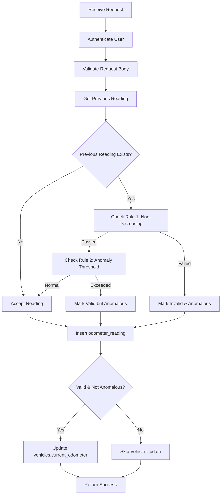

# Odometer Validator Edge Function

Validates odometer readings and flags anomalies before storing them in the database.

## Purpose

This Edge Function implements business logic for odometer reading validation as specified in Requirements 4.2 and 4.3:
- **Requirement 4.2**: Validate that new odometer reading is greater than or equal to previous reading
- **Requirement 4.3**: Flag anomalies when odometer increases by more than 1000 km within 24 hours

## Endpoint

```
POST /functions/v1/odometer-validator
```

## Authentication

Requires valid JWT token in Authorization header:
```
Authorization: Bearer <jwt_token>
```

## Request Body

```typescript
{
  vehicle_id: string;        // UUID of the vehicle
  reading: number;           // Odometer reading in kilometers (must be >= 0)
  timestamp?: string;        // ISO 8601 timestamp (optional, defaults to now)
  source: 'manual' | 'excel' | 'bulk' | 'gps' | 'api';  // Source of the reading
}
```

## Response

### Success Response (201 Created)

```typescript
{
  valid: boolean;              // True if reading passes validation
  anomaly_flag: boolean;       // True if reading is anomalous
  reason?: string;             // Explanation if invalid or anomalous
  odometer_reading_id: string; // UUID of created odometer_reading record
}
```

### Error Responses

**400 Bad Request** - Invalid input
```json
{
  "error": "Missing required fields",
  "details": "vehicle_id, reading, and source are required"
}
```

**401 Unauthorized** - Missing or invalid token
```json
{
  "error": "Missing authorization token",
  "code": "MISSING_TOKEN"
}
```

**403 Forbidden** - Insufficient permissions
```json
{
  "error": "Forbidden",
  "code": "FORBIDDEN"
}
```

**500 Internal Server Error** - Server error
```json
{
  "error": "Internal server error",
  "details": "Error message"
}
```

## Validation Rules

### Rule 1: Non-Decreasing Readings (Requirement 4.2)

New odometer reading must be **greater than or equal to** the previous reading.

**Example - Invalid:**
```
Previous reading: 50000 km
New reading: 49500 km
Result: valid=false, anomaly_flag=true, reason="Odometer readings cannot decrease"
```

**Example - Valid:**
```
Previous reading: 50000 km
New reading: 50500 km
Result: valid=true, anomaly_flag=false
```

### Rule 2: Anomaly Detection (Requirement 4.3)

If odometer increases by **more than 1000 km within 24 hours**, flag as anomalous.

**Example - Anomalous:**
```
Previous reading: 50000 km at 2024-01-01 10:00:00
New reading: 51500 km at 2024-01-01 15:00:00 (5 hours later, +1500 km)
Result: valid=true, anomaly_flag=true, reason="Odometer increased by 1500 km in 5.0 hours..."
```

**Example - Normal:**
```
Previous reading: 50000 km at 2024-01-01 10:00:00
New reading: 50800 km at 2024-01-01 15:00:00 (5 hours later, +800 km)
Result: valid=true, anomaly_flag=false
```

### Rule 3: First Reading

If no previous reading exists for the vehicle, any non-negative reading is accepted.

**Example:**
```
No previous readings
New reading: 50000 km
Result: valid=true, anomaly_flag=false
```

## Business Logic Flow



## Database Operations

### 1. Read Previous Reading
```sql
SELECT reading, timestamp
FROM odometer_readings
WHERE tenant_id = ? AND vehicle_id = ?
ORDER BY timestamp DESC
LIMIT 1;
```

### 2. Insert Odometer Reading
```sql
INSERT INTO odometer_readings (
  tenant_id, vehicle_id, reading, timestamp, source,
  submitted_by, is_anomalous, anomaly_reason, confirmed
) VALUES (?, ?, ?, ?, ?, ?, ?, ?, ?);
```

### 3. Update Vehicle Odometer (only if valid and not anomalous)
```sql
UPDATE vehicles
SET current_odometer = ?, updated_at = NOW()
WHERE tenant_id = ? AND id = ?;
```

## Permissions

All roles with `vehicles:read` permission can submit odometer readings:
- ✅ super_admin
- ✅ company_owner
- ✅ fleet_manager
- ✅ workshop_manager
- ✅ maintenance_engineer
- ✅ mechanic
- ✅ driver
- ✅ inspector
- ✅ accountant
- ✅ auditor

## Usage Examples

### Example 1: Submit Manual Reading

```bash
curl -X POST https://your-project.supabase.co/functions/v1/odometer-validator \
  -H "Authorization: Bearer YOUR_JWT_TOKEN" \
  -H "Content-Type: application/json" \
  -d '{
    "vehicle_id": "123e4567-e89b-12d3-a456-426614174000",
    "reading": 50500,
    "source": "manual"
  }'
```

**Response:**
```json
{
  "valid": true,
  "anomaly_flag": false,
  "odometer_reading_id": "789e4567-e89b-12d3-a456-426614174999"
}
```

### Example 2: GPS Reading with Timestamp

```bash
curl -X POST https://your-project.supabase.co/functions/v1/odometer-validator \
  -H "Authorization: Bearer YOUR_JWT_TOKEN" \
  -H "Content-Type: application/json" \
  -d '{
    "vehicle_id": "123e4567-e89b-12d3-a456-426614174000",
    "reading": 51500,
    "source": "gps",
    "timestamp": "2024-01-15T10:30:00Z"
  }'
```

**Response (Anomalous):**
```json
{
  "valid": true,
  "anomaly_flag": true,
  "reason": "Odometer increased by 1000 km in 5.2 hours (> 1000 km in 24 hours). Please confirm this reading is correct.",
  "odometer_reading_id": "789e4567-e89b-12d3-a456-426614174999"
}
```

### Example 3: Invalid Decreasing Reading

```bash
curl -X POST https://your-project.supabase.co/functions/v1/odometer-validator \
  -H "Authorization: Bearer YOUR_JWT_TOKEN" \
  -H "Content-Type: application/json" \
  -d '{
    "vehicle_id": "123e4567-e89b-12d3-a456-426614174000",
    "reading": 49000,
    "source": "manual"
  }'
```

**Response (Invalid):**
```json
{
  "valid": false,
  "anomaly_flag": true,
  "reason": "New reading (49000 km) is less than previous reading (50500 km). Odometer readings cannot decrease.",
  "odometer_reading_id": "789e4567-e89b-12d3-a456-426614174999"
}
```

## Local Development

### Start Function Locally
```bash
supabase functions serve odometer-validator
```

### Test Function
```bash
# Set environment variables
export SUPABASE_URL=http://localhost:54321
export SUPABASE_ANON_KEY=your-anon-key
export TEST_JWT_TOKEN=your-test-token

# Run tests
deno test --allow-net --allow-env edge-functions/odometer-validator/test.ts
```

### Deploy Function
```bash
supabase functions deploy odometer-validator
```

## Error Handling

The function implements comprehensive error handling:

1. **Authentication Errors**: Returns 401 or 403 with descriptive error codes
2. **Validation Errors**: Returns 400 with specific validation messages
3. **Database Errors**: Catches and logs database errors, returns 500
4. **Unhandled Exceptions**: Catches all errors, logs them, returns 500

All errors are logged to console for debugging:
```typescript
console.error('[Odometer Validator] Error:', error);
```

## Integration with Other Systems

### GPS Integration (gps-processor)
The `gps-processor` Edge Function calls `odometer-validator` to validate GPS telemetry odometer readings.

### Mobile Apps
Driver and mechanic mobile apps call this function when submitting manual odometer readings.

### Bulk Import
The bulk import system calls this function for each odometer reading in Excel/CSV uploads.

## Monitoring

View function logs:
```bash
supabase functions logs odometer-validator
```

Monitor metrics in Supabase Dashboard:
- Invocation count
- Error rate
- Average execution time

## Future Enhancements

Potential improvements (not in current scope):
1. Unit conversion (miles to kilometers)
2. Configurable anomaly thresholds per tenant
3. Machine learning-based anomaly detection
4. Batch validation for bulk imports
5. Webhook notifications for anomalies

