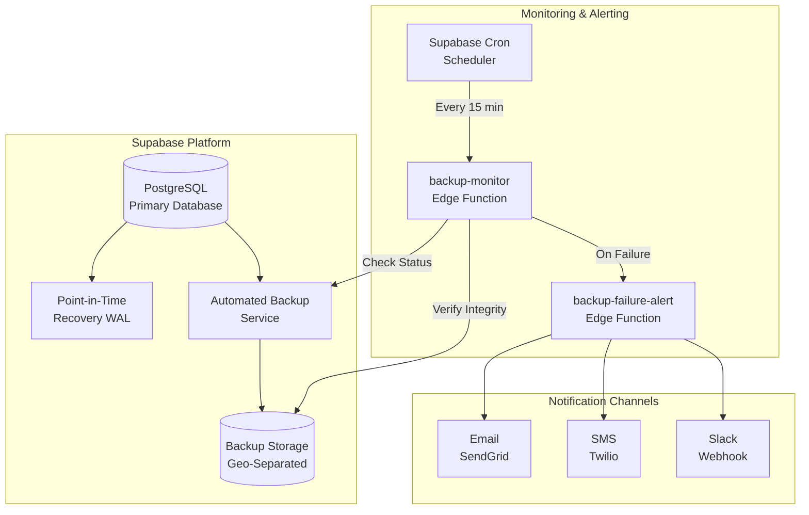

# FleetGuard AI: Backup and Recovery Guide

## Overview

This guide documents the automated backup and recovery configuration for FleetGuard AI. The system uses Supabase's native backup capabilities combined with custom monitoring and alerting to ensure data protection and business continuity.

## Requirements Compliance

This implementation satisfies **Requirement 27: Data Backup and Recovery**:

- ✅ **27.1**: Automated database backups daily at 1:00 AM system time
- ✅ **27.2**: Retention policy: 30 days (daily), 90 days (weekly), 1 year (monthly)
- ✅ **27.3**: Backups stored in geographically separate location from primary database
- ✅ **27.4**: Backup integrity verification after each backup operation
- ✅ **27.5**: Point-in-time recovery capability with maximum 24-hour data loss
- ✅ **27.6**: Backup failure alerts to system administrators within 5 minutes

---

## Architecture



---

## Backup Strategy

### 1. Automated Backups (Requirement 27.1)

**Supabase Pro/Team Tier Features:**
- **Daily Full Backups**: Automated at 1:00 AM UTC (configurable)
- **Continuous WAL Archiving**: Write-Ahead Log files archived in real-time for PITR
- **Automated Scheduling**: No manual intervention required

**Configuration Location:**
- Supabase Dashboard → Settings → Database → Backup Settings
- Enable "Automated Daily Backups"
- Set backup time to 01:00 UTC (or preferred timezone)

### 2. Retention Policy (Requirement 27.2)

**Supabase Backup Retention:**

| Backup Type | Frequency | Retention Period | Storage Location |
|-------------|-----------|------------------|------------------|
| **Daily Backups** | Every 24 hours | 30 days | AWS S3 (Geo-Separated) |
| **Weekly Backups** | Every Sunday | 90 days (12 weeks) | AWS S3 (Geo-Separated) |
| **Monthly Backups** | First day of month | 1 year (12 months) | AWS S3 (Geo-Separated) |
| **WAL Archives** | Continuous | 7 days (for PITR) | AWS S3 (Geo-Separated) |

**Implementation Notes:**
- Supabase automatically handles backup rotation based on retention settings
- Weekly backups are promoted from daily backups every Sunday
- Monthly backups are promoted from weekly backups on the 1st of each month
- Expired backups are automatically deleted per retention policy

### 3. Geographic Separation (Requirement 27.3)

**Supabase Backup Storage:**
- **Primary Database**: Hosted in AWS region (e.g., us-east-1)
- **Backup Storage**: AWS S3 with cross-region replication
- **Geographic Separation**: Backups stored in different AWS Availability Zones and regions
- **Encryption**: AES-256 encryption at rest for all backup files

**Verification:**
```bash
# Check backup storage location via Supabase CLI
supabase db dump --remote --backup-id <backup-id> --dry-run
```

### 4. Point-in-Time Recovery (Requirement 27.5)

**PITR Capability:**
- **Recovery Point Objective (RPO)**: Maximum 24-hour data loss (typically < 1 hour)
- **WAL Archiving**: Continuous archival of transaction logs
- **Recovery Window**: Can restore to any point within the last 7 days
- **Granularity**: Second-level precision for recovery time

**Enabling PITR:**
1. Navigate to Supabase Dashboard → Database → Backups
2. Enable "Point-in-Time Recovery"
3. Configure WAL archival settings
4. Set retention to 7 days (minimum for 24-hour RPO compliance)

**PITR Usage:**
```bash
# Restore database to specific timestamp
supabase db restore \
  --remote \
  --timestamp "2025-06-10 14:30:00 UTC"
```

---

## Backup Verification (Requirement 27.4)

### Edge Function: backup-monitor

The `backup-monitor` Edge Function runs every 15 minutes to verify backup health and integrity.

**Verification Checks:**

1. **Backup Existence Check**
   - Queries Supabase backup API for latest backup
   - Ensures backup completed within expected timeframe (< 25 hours for daily backups)

2. **Backup Integrity Verification**
   - Checks backup file size and checksum
   - Validates backup metadata (table counts, row counts)
   - Compares against previous successful backups

3. **PITR Health Check**
   - Verifies WAL archiving is active
   - Checks for WAL archive gaps
   - Validates WAL retention meets RPO requirements

4. **Storage Verification**
   - Confirms backup files exist in geo-separated storage
   - Validates encryption status
   - Checks storage quota and available space

**Monitoring Schedule:**
```yaml
# supabase/functions/backup-monitor/cron.yaml
schedule: "*/15 * * * *"  # Every 15 minutes
timezone: "UTC"
```

**Success Criteria:**
- Latest backup exists and is < 25 hours old
- Backup file size is within 10% of previous successful backup
- WAL archiving has no gaps > 5 minutes
- Backup storage location is geo-separated from primary DB

---

## Backup Failure Alerting (Requirement 27.6)

### Edge Function: backup-failure-alert

The `backup-failure-alert` Edge Function is triggered when `backup-monitor` detects a failure. Alerts are sent to system administrators within 5 minutes.

**Alert Triggers:**

1. **Backup Missing**: No backup completed in last 25 hours
2. **Backup Failed**: Backup process reported errors
3. **Integrity Check Failed**: Backup file corrupted or incomplete
4. **PITR Degraded**: WAL archiving stopped or gaps detected
5. **Storage Issues**: Backup storage unreachable or full

**Alert Channels:**

| Channel | Priority | Response Time |
|---------|----------|---------------|
| **Email** | High | < 2 minutes |
| **SMS** | Critical | < 1 minute |
| **Slack** | Medium | < 2 minutes |
| **PagerDuty** | Critical (optional) | < 30 seconds |

**Alert Content:**
```json
{
  "alert_type": "backup_failure",
  "severity": "critical",
  "timestamp": "2025-06-10T14:35:00Z",
  "details": {
    "failure_reason": "Backup not found in last 25 hours",
    "last_successful_backup": "2025-06-08T01:00:00Z",
    "expected_backup_time": "2025-06-10T01:00:00Z",
    "pitr_status": "healthy",
    "action_required": "Investigate backup service and manually trigger backup if needed"
  },
  "runbook_url": "https://docs.fleetguard.ai/runbooks/backup-failure"
}
```

**Alert Configuration:**
```typescript
// edge-functions/backup-failure-alert/config.ts
export const alertConfig = {
  email: {
    enabled: true,
    recipients: ['ops@fleetguard.ai', 'admin@fleetguard.ai'],
    from: 'alerts@fleetguard.ai',
    subject: '[CRITICAL] FleetGuard AI Backup Failure'
  },
  sms: {
    enabled: true,
    recipients: ['+1-555-0100', '+1-555-0101'],
    message: 'CRITICAL: FleetGuard backup failed. Check email for details.'
  },
  slack: {
    enabled: true,
    webhook_url: process.env.SLACK_ALERT_WEBHOOK,
    channel: '#fleetguard-alerts'
  }
};
```

---

## Recovery Procedures

### 1. Full Database Restore

**Use Case**: Catastrophic database corruption or data center failure

**Procedure:**
```bash
# 1. Stop all application traffic
supabase functions disable --all

# 2. List available backups
supabase db backup list --remote

# 3. Restore from specific backup
supabase db restore \
  --remote \
  --backup-id <backup-id> \
  --confirm

# 4. Verify restoration
supabase db dump --remote | grep "CREATE TABLE" | wc -l

# 5. Resume application traffic
supabase functions enable --all
```

**Recovery Time Objective (RTO)**: 2-4 hours (depends on database size)

### 2. Point-in-Time Recovery

**Use Case**: Data corruption at known timestamp, need to recover to specific point

**Procedure:**
```bash
# 1. Identify recovery target time
RECOVERY_TIME="2025-06-10 14:30:00 UTC"

# 2. Stop application writes
supabase functions disable --pattern "write-*"

# 3. Perform PITR
supabase db restore \
  --remote \
  --timestamp "$RECOVERY_TIME" \
  --confirm

# 4. Verify data integrity
# Run application health checks

# 5. Resume full operations
supabase functions enable --all
```

**RTO**: 1-2 hours  
**RPO**: Maximum 24 hours (typically < 1 hour with WAL archiving)

### 3. Selective Table Recovery

**Use Case**: Single table data corruption, need to restore specific table

**Procedure:**
```bash
# 1. Create temporary database from backup
supabase projects create fleetguard-recovery --region us-east-1

# 2. Restore backup to temporary database
supabase db restore \
  --project fleetguard-recovery \
  --backup-id <backup-id>

# 3. Export specific table
supabase db dump \
  --project fleetguard-recovery \
  --table public.vehicles \
  > vehicles_backup.sql

# 4. Import to production (in transaction)
psql $DATABASE_URL <<EOF
BEGIN;
-- Backup current data
CREATE TABLE vehicles_backup AS SELECT * FROM vehicles;
-- Clear and restore
TRUNCATE vehicles CASCADE;
\i vehicles_backup.sql
-- Verify
SELECT COUNT(*) FROM vehicles;
COMMIT;
EOF

# 5. Cleanup temporary database
supabase projects delete fleetguard-recovery --confirm
```

**RTO**: 30 minutes - 1 hour  
**RPO**: Depends on backup age

### 4. Disaster Recovery (DR)

**Use Case**: Complete region failure, need to failover to DR region

**Procedure:**
```bash
# 1. Activate DR Supabase project in alternate region
supabase projects activate fleetguard-dr

# 2. Restore latest backup
supabase db restore \
  --project fleetguard-dr \
  --backup-id <latest-backup> \
  --confirm

# 3. Apply WAL archives for PITR (if available)
supabase db pitr-apply \
  --project fleetguard-dr \
  --timestamp "latest"

# 4. Update DNS to point to DR region
# Update CDN configuration
# Update mobile app API endpoints (if hardcoded)

# 5. Verify all services operational
supabase functions test --project fleetguard-dr

# 6. Monitor and communicate status to users
```

**RTO**: 4-8 hours  
**RPO**: < 24 hours (typically < 1 hour with WAL)

---

## Monitoring Dashboard

### Backup Health Metrics

**Key Metrics to Monitor:**

1. **Backup Success Rate**: `(successful_backups / total_backup_attempts) * 100`
   - **Target**: > 99.5%
   - **Alert Threshold**: < 95%

2. **Backup Duration**: Time taken to complete backup
   - **Target**: < 30 minutes for databases < 100GB
   - **Alert Threshold**: > 2 hours

3. **Backup Size Trend**: Track backup file size over time
   - **Expected**: Gradual increase with data growth
   - **Alert**: Sudden > 50% change (may indicate data issue)

4. **PITR Coverage**: Percentage of time PITR is available
   - **Target**: 100%
   - **Alert Threshold**: < 99%

5. **Recovery Test Success Rate**: Regular DR drills
   - **Target**: 100% successful test restores
   - **Schedule**: Monthly DR drill

**Dashboard Query:**
```sql
-- Backup health summary (custom tracking table)
SELECT
  DATE(backup_timestamp) AS backup_date,
  COUNT(*) AS total_backups,
  SUM(CASE WHEN status = 'success' THEN 1 ELSE 0 END) AS successful_backups,
  AVG(duration_seconds) AS avg_duration_seconds,
  AVG(backup_size_mb) AS avg_size_mb,
  MAX(CASE WHEN status = 'failed' THEN error_message END) AS last_failure
FROM backup_monitoring_log
WHERE backup_timestamp > NOW() - INTERVAL '30 days'
GROUP BY DATE(backup_timestamp)
ORDER BY backup_date DESC;
```

---

## Backup Validation Testing

### Automated Backup Testing

**Monthly DR Drill Procedure:**

1. **Create Test Restoration**
   ```bash
   ./scripts/test-backup-restore.sh --backup-id latest --dry-run false
   ```

2. **Validate Data Integrity**
   ```bash
   ./scripts/validate-backup-integrity.sh --compare-checksums
   ```

3. **Performance Benchmarks**
   ```bash
   ./scripts/benchmark-restored-db.sh --queries standard-workload.sql
   ```

4. **Document Results**
   - Restoration time
   - Data completeness check
   - Performance comparison (restored vs. production)
   - Issues encountered and resolutions

**Test Schedule:**
- **Daily**: Backup existence and integrity checks (automated via `backup-monitor`)
- **Weekly**: Backup file restore to staging environment
- **Monthly**: Full DR drill with application testing
- **Quarterly**: Cross-region DR failover test

---

## Operational Runbooks

### Runbook 1: Backup Not Completing

**Symptoms:**
- Alert: "Backup not found in last 25 hours"
- Backup service showing errors in logs

**Diagnosis:**
```bash
# Check Supabase backup service status
supabase db backup status --remote

# Check database size and growth
psql $DATABASE_URL -c "SELECT pg_size_pretty(pg_database_size(current_database()))"

# Check for long-running queries blocking backup
psql $DATABASE_URL -c "SELECT pid, age(clock_timestamp(), query_start), query FROM pg_stat_activity WHERE state != 'idle' ORDER BY age DESC"
```

**Resolution:**
1. Identify and terminate long-running queries blocking backup
2. Manually trigger backup: `supabase db backup create --remote`
3. Monitor backup progress in Supabase Dashboard
4. If backup repeatedly fails, contact Supabase support with project ID

### Runbook 2: PITR Degraded

**Symptoms:**
- Alert: "WAL archiving stopped or gaps detected"
- PITR recovery window reduced

**Diagnosis:**
```bash
# Check WAL archiving status
psql $DATABASE_URL -c "SELECT * FROM pg_stat_archiver"

# Check for disk space issues
psql $DATABASE_URL -c "SELECT pg_size_pretty(pg_database_size(current_database()))"
```

**Resolution:**
1. Check Supabase project storage limits
2. Archive or purge old audit logs if storage is full
3. Verify network connectivity to WAL archive storage
4. If issue persists, escalate to Supabase support

### Runbook 3: Backup Integrity Check Failed

**Symptoms:**
- Alert: "Backup file corrupted or incomplete"
- Backup size significantly smaller than expected

**Diagnosis:**
```bash
# List recent backups with sizes
supabase db backup list --remote --format json | jq '.[] | {id, created_at, size_mb}'

# Compare current backup size with historical average
```

**Resolution:**
1. Do NOT delete the suspected corrupt backup yet
2. Immediately trigger a new manual backup
3. Verify the new backup completes successfully
4. Compare checksums and table counts between backups
5. Document findings and notify team
6. After confirming new backup is valid, can delete corrupt backup

---

## Security Considerations

### Backup Access Control

**Principle of Least Privilege:**
- Only authorized personnel can trigger manual backups
- Only authorized personnel can restore from backups
- Backup files are encrypted at rest (AES-256)
- Backup access requires MFA authentication

**IAM Roles:**
```yaml
backup_admin:
  permissions:
    - backup:create
    - backup:list
    - backup:restore
    - backup:delete
  users:
    - ops-team-lead
    - database-admin

backup_viewer:
  permissions:
    - backup:list
    - backup:view-metadata
  users:
    - all-engineers
```

### Backup Encryption

**Encryption at Rest:**
- All backup files encrypted with AES-256
- Encryption keys managed by AWS KMS
- Keys automatically rotated annually
- Backup decryption requires both Supabase credentials AND AWS KMS permissions

**Encryption in Transit:**
- All backup transfers use TLS 1.3
- Backup download requires authenticated HTTPS requests
- No plaintext backup data transmitted over network

---

## Compliance and Auditing

### Audit Logging

All backup operations are logged to the `audit_logs` table:

```sql
-- Backup operation audit log
INSERT INTO audit_logs (
  table_name,
  operation,
  actor,
  details,
  timestamp
) VALUES (
  'system_backups',
  'BACKUP_RESTORE',
  auth.uid(),
  jsonb_build_object(
    'backup_id', 'backup-20250610-010000',
    'restore_timestamp', '2025-06-10 14:30:00 UTC',
    'reason', 'Data recovery after accidental deletion'
  ),
  NOW()
);
```

### Compliance Requirements

**GDPR Compliance:**
- Backups include personal data and are subject to GDPR
- Data retention in backups aligns with GDPR retention limits
- Users can request deletion of their data from backups (via data export/deletion workflow)

**SOC 2 Compliance:**
- Backup monitoring logs retained for 7 years
- Quarterly DR drills documented
- Backup access requires MFA and is fully audited

**HIPAA Compliance (if applicable):**
- All backups encrypted (AES-256)
- Backup access fully audited
- Backup integrity verified after each backup

---

## Cost Optimization

### Backup Storage Costs

**Supabase Pro Tier:**
- First 8GB of backups included
- Additional backup storage: $0.125 per GB/month

**Estimated Costs:**

| Database Size | Daily Backups (30d) | Weekly Backups (90d) | Monthly Backups (1y) | Total Storage | Est. Monthly Cost |
|---------------|---------------------|----------------------|----------------------|---------------|-------------------|
| 10 GB | 300 GB | 120 GB | 120 GB | 540 GB | $67/month |
| 50 GB | 1,500 GB | 600 GB | 600 GB | 2,700 GB | $337/month |
| 100 GB | 3,000 GB | 1,200 GB | 1,200 GB | 5,400 GB | $675/month |

**Cost Optimization Strategies:**
1. Compress old backups before archiving to monthly retention
2. Archive non-critical tables separately with longer retention
3. Purge old audit logs before backup (retain per policy only)
4. Use incremental backups if supported by Supabase

---

## Configuration Checklist

### Initial Setup

- [ ] Enable automated daily backups in Supabase Dashboard
- [ ] Set backup time to 01:00 UTC
- [ ] Configure retention policy: 30/90/365 days
- [ ] Enable Point-in-Time Recovery (PITR)
- [ ] Configure WAL archiving with 7-day retention
- [ ] Deploy `backup-monitor` Edge Function
- [ ] Deploy `backup-failure-alert` Edge Function
- [ ] Configure Supabase cron job for backup monitoring (every 15 minutes)
- [ ] Set up alert notification channels (Email, SMS, Slack)
- [ ] Test backup restoration to staging environment
- [ ] Document recovery procedures
- [ ] Train operations team on backup/restore procedures
- [ ] Schedule monthly DR drills

### Ongoing Maintenance

- [ ] **Daily**: Review backup monitoring dashboard
- [ ] **Weekly**: Verify backup completion and integrity
- [ ] **Monthly**: Perform DR drill and restore test
- [ ] **Quarterly**: Review and update retention policies
- [ ] **Annually**: Audit backup access controls and encryption keys

---

## Support and Escalation

### Internal Support

**Tier 1 - DevOps Team:**
- Monitor backup health dashboard
- Respond to backup failure alerts
- Perform routine backup operations

**Tier 2 - Database Administrators:**
- Troubleshoot backup failures
- Perform data recovery operations
- Optimize backup performance

**Tier 3 - Supabase Support:**
- Escalate platform-level backup issues
- Request backup integrity verification
- Coordinate disaster recovery scenarios

### Escalation Contact

**Backup Failures:**
- Slack: #fleetguard-alerts
- Email: ops@fleetguard.ai
- PagerDuty: Critical incidents

**Supabase Support:**
- Email: support@supabase.com
- Dashboard: Supabase Dashboard → Support
- SLA: Response within 4 hours (Pro/Team tier)

---

## Appendix

### A. Backup File Naming Convention

```
fleetguard-prod-backup-YYYYMMDD-HHMMSS.sql.gz
Example: fleetguard-prod-backup-20250610-010000.sql.gz
```

### B. Supabase Backup API Reference

```typescript
// List backups
const { data: backups } = await supabase
  .rpc('list_backups', { project_id: 'fleetguard-prod' });

// Create manual backup
const { data: backup } = await supabase
  .rpc('create_backup', { project_id: 'fleetguard-prod' });

// Restore from backup
const { data: result } = await supabase
  .rpc('restore_backup', {
    project_id: 'fleetguard-prod',
    backup_id: 'backup-20250610-010000'
  });
```

### C. Related Documentation

- [Supabase Backup Documentation](https://supabase.com/docs/guides/platform/backups)
- [PostgreSQL PITR Guide](https://www.postgresql.org/docs/current/continuous-archiving.html)
- [FleetGuard Disaster Recovery Plan](./DISASTER_RECOVERY_PLAN.md)
- [FleetGuard Security Guide](./ENCRYPTION_CONFIGURATION.md)

---

**Document Version**: 1.0  
**Last Updated**: June 10, 2025  
**Next Review**: September 10, 2025  
**Owner**: FleetGuard DevOps Team
