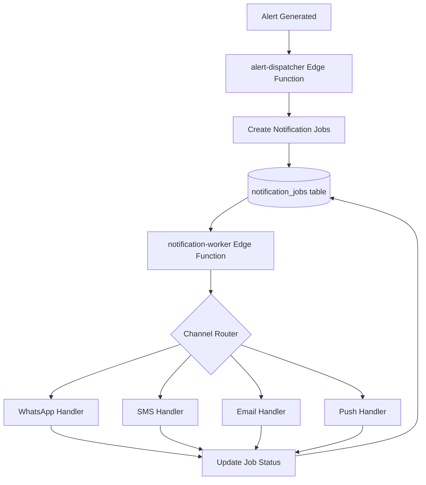

# FleetGuard AI Multi-Channel Notification Setup - Master Guide

## Overview

This master guide provides a comprehensive overview of setting up all four notification channels for FleetGuard AI. Use this as a starting point, then follow the detailed guides for each service.

**Notification Channels:**
1. ✅ **WhatsApp Business API** - For WhatsApp messages
2. ✅ **Twilio SMS** - For SMS text messages
3. ✅ **SendGrid Email** - For email notifications
4. ✅ **Firebase Cloud Messaging (FCM)** - For mobile push notifications

---

## Quick Start Checklist

### Phase 1: Environment Setup (5 minutes)

- [ ] Copy `.env.example` to `.env`
- [ ] Review the required environment variables for each channel
- [ ] Decide which channels to configure first (email recommended for testing)

### Phase 2: Email Setup (20 minutes) - **Recommended First**

Email is the easiest to set up and test.

- [ ] Follow [SENDGRID_EMAIL_SETUP.md](./SENDGRID_EMAIL_SETUP.md)
- [ ] Create SendGrid account
- [ ] Verify sender email
- [ ] Generate API key
- [ ] Create email template
- [ ] Test email delivery

### Phase 3: SMS Setup (15 minutes)

- [ ] Follow [TWILIO_SMS_SETUP.md](./TWILIO_SMS_SETUP.md)
- [ ] Create Twilio account
- [ ] Purchase phone number
- [ ] Get Account SID and Auth Token
- [ ] Test SMS delivery

### Phase 4: WhatsApp Setup (30-45 minutes)

**Note:** Template approval takes 1-2 business days

- [ ] Follow [WHATSAPP_SETUP.md](./WHATSAPP_SETUP.md)
- [ ] Create Facebook Business App
- [ ] Add WhatsApp product
- [ ] Configure phone number
- [ ] Get access token
- [ ] Create message templates
- [ ] Wait for template approval ⏳
- [ ] Test WhatsApp delivery

### Phase 5: Push Notifications Setup (20-30 minutes)

- [ ] Follow [FCM_PUSH_SETUP.md](./FCM_PUSH_SETUP.md)
- [ ] Create Firebase project
- [ ] Add Android app
- [ ] Add iOS app
- [ ] Configure APNs (iOS)
- [ ] Get server key
- [ ] Configure mobile app
- [ ] Test push notifications

### Phase 6: Integration Testing (10 minutes)

- [ ] Run notification configuration validation
- [ ] Test each configured channel
- [ ] Verify delivery in FleetGuard AI dashboard
- [ ] Check notification_jobs table

---

## Detailed Setup Guides

### 1. Email Notifications (SendGrid)

**Time:** 20 minutes  
**Difficulty:** Easy  
**Cost:** Free tier (100 emails/day)

**Quick Steps:**
1. Create SendGrid account
2. Verify sender email (or authenticate domain)
3. Generate API key with "Mail Send" permission
4. Create dynamic email template
5. Add credentials to `.env`:
   ```bash
   SENDGRID_API_KEY=SG.xxxxxxxxx
   SENDGRID_FROM_EMAIL=noreply@fleetguard.ai
   SENDGRID_FROM_NAME=FleetGuard AI
   ```

**Full Guide:** [SENDGRID_EMAIL_SETUP.md](./SENDGRID_EMAIL_SETUP.md)

---

### 2. SMS Notifications (Twilio)

**Time:** 15 minutes  
**Difficulty:** Easy  
**Cost:** Pay-as-you-go (~$0.0079/SMS in US)

**Quick Steps:**
1. Create Twilio account (free trial available)
2. Purchase Twilio phone number
3. Copy Account SID and Auth Token
4. (Optional) Create Messaging Service
5. Add credentials to `.env`:
   ```bash
   TWILIO_ACCOUNT_SID=ACxxxxxxxxx
   TWILIO_AUTH_TOKEN=xxxxxxxxx
   TWILIO_PHONE_NUMBER=+1234567890
   ```

**Full Guide:** [TWILIO_SMS_SETUP.md](./TWILIO_SMS_SETUP.md)

---

### 3. WhatsApp Notifications (WhatsApp Business API)

**Time:** 30-45 minutes (+ 1-2 days for template approval)  
**Difficulty:** Moderate  
**Cost:** Pay-per-conversation (~$0.005-$0.05)

**Quick Steps:**
1. Create Facebook Business App
2. Add WhatsApp product
3. Configure business phone number
4. Generate permanent access token (via System User)
5. Create message templates
6. Submit templates for approval ⏳
7. Add credentials to `.env`:
   ```bash
   WHATSAPP_API_URL=https://graph.facebook.com/v17.0
   WHATSAPP_PHONE_NUMBER_ID=123456789012345
   WHATSAPP_API_TOKEN=EAAxxxxxxxxx
   WHATSAPP_BUSINESS_ACCOUNT_ID=123456789012345
   ```

**Full Guide:** [WHATSAPP_SETUP.md](./WHATSAPP_SETUP.md)

**Important:** WhatsApp requires pre-approved templates. Plan ahead for template approval time.

---

### 4. Push Notifications (Firebase Cloud Messaging)

**Time:** 20-30 minutes  
**Difficulty:** Moderate  
**Cost:** Free

**Quick Steps:**
1. Create Firebase project
2. Register Android app (download google-services.json)
3. Register iOS app (download GoogleService-Info.plist)
4. Upload APNs authentication key (iOS)
5. Get FCM server key or service account
6. Configure React Native app
7. Add credentials to `.env`:
   ```bash
   FCM_SERVER_KEY=AAAAxxxxxxxxx
   FCM_PROJECT_ID=fleetguard-ai-12345
   ```

**Full Guide:** [FCM_PUSH_SETUP.md](./FCM_PUSH_SETUP.md)

---

## Environment Variables Reference

### Complete .env Configuration

```bash
# ============================================================================
# FleetGuard AI - Notification Service Configuration
# ============================================================================

# ----------------------------------------------------------------------------
# WhatsApp Business API
# ----------------------------------------------------------------------------
WHATSAPP_API_URL=https://graph.facebook.com/v17.0
WHATSAPP_PHONE_NUMBER_ID=your_phone_number_id_here
WHATSAPP_API_TOKEN=your_whatsapp_access_token_here
WHATSAPP_BUSINESS_ACCOUNT_ID=your_business_account_id_here
WHATSAPP_ALERT_TEMPLATE_NAME=alert_notification

# ----------------------------------------------------------------------------
# Twilio SMS
# ----------------------------------------------------------------------------
TWILIO_ACCOUNT_SID=ACxxxxxxxxxxxxxxxxxxxxxxxxxxxxxxxx
TWILIO_AUTH_TOKEN=your_twilio_auth_token_here
TWILIO_PHONE_NUMBER=+1234567890
TWILIO_MESSAGING_SERVICE_SID=MGxxxxxxxxxxxxxxxxxxxxxxxxxxxxxxxx  # Optional

# ----------------------------------------------------------------------------
# SendGrid Email
# ----------------------------------------------------------------------------
SENDGRID_API_KEY=SG.xxxxxxxxxxxxxxxxxxxxxxxxxxxxxxxxxxxxxxxxxxxxxxxxxxxxxxxxxxxxxxxx
SENDGRID_FROM_EMAIL=noreply@fleetguard.ai
SENDGRID_FROM_NAME=FleetGuard AI
SENDGRID_ALERT_TEMPLATE_ID=d-xxxxxxxxxxxxxxxxxxxxxxxxxxxxxxxx  # Optional

# ----------------------------------------------------------------------------
# Firebase Cloud Messaging (FCM)
# ----------------------------------------------------------------------------
FCM_SERVER_KEY=AAAAxxxxxxx:APA91bxxxxxxxxxxxxxxxxxxxxxxxxxxxxxxxx
FCM_PROJECT_ID=fleetguard-ai-12345
FCM_SERVICE_ACCOUNT_KEY_PATH=./firebase-service-account.json  # Optional

# ----------------------------------------------------------------------------
# Notification Configuration
# ----------------------------------------------------------------------------
MAX_RETRY_ATTEMPTS=3
RETRY_BACKOFF_DELAYS=60000,300000,900000
JOB_BATCH_SIZE=100
```

---

## Testing Your Setup

### 1. Validate Configuration

Run the configuration validator:

```typescript
import { validateNotificationConfig, getConfigSummary } from './shared/notifications/config.ts';

const validation = validateNotificationConfig();
console.log(getConfigSummary());

if (!validation.valid) {
  console.error('Configuration errors:', validation.errors);
}
```

Expected output:
```
=== Notification Configuration Summary ===
Configured Channels: email, sms, push
Unconfigured Channels: whatsapp
Errors/Warnings:
  - Channel 'whatsapp' is not configured. Missing: WHATSAPP_API_TOKEN, WHATSAPP_PHONE_NUMBER_ID
=========================================
```

### 2. Test Individual Channels

#### Test Email

```bash
curl -X POST https://your-project.supabase.co/functions/v1/alert-dispatcher \
  -H "Authorization: Bearer YOUR_USER_TOKEN" \
  -H "Content-Type: application/json" \
  -d '{
    "alert_id": "test-alert-123",
    "channels": ["email"],
    "user_ids": ["your-user-id"]
  }'
```

#### Test SMS

```bash
curl -X POST https://your-project.supabase.co/functions/v1/alert-dispatcher \
  -H "Authorization: Bearer YOUR_USER_TOKEN" \
  -H "Content-Type: application/json" \
  -d '{
    "alert_id": "test-alert-123",
    "channels": ["sms"],
    "user_ids": ["your-user-id"]
  }'
```

#### Test WhatsApp

```bash
curl -X POST https://your-project.supabase.co/functions/v1/alert-dispatcher \
  -H "Authorization: Bearer YOUR_USER_TOKEN" \
  -H "Content-Type: application/json" \
  -d '{
    "alert_id": "test-alert-123",
    "channels": ["whatsapp"],
    "user_ids": ["your-user-id"]
  }'
```

#### Test Push Notification

```bash
curl -X POST https://your-project.supabase.co/functions/v1/alert-dispatcher \
  -H "Authorization: Bearer YOUR_USER_TOKEN" \
  -H "Content-Type: application/json" \
  -d '{
    "alert_id": "test-alert-123",
    "channels": ["push"],
    "user_ids": ["your-user-id"]
  }'
```

### 3. Check Delivery Status

Query the notification_jobs table:

```sql
SELECT 
  id,
  channel,
  recipient,
  status,
  attempt,
  error_message,
  sent_at,
  created_at
FROM notification_jobs
WHERE alert_id = 'test-alert-123'
ORDER BY created_at DESC;
```

Expected statuses:
- ✅ `sent` - Successfully delivered
- ⏳ `queued` - Waiting to be processed
- 🔄 `processing` - Currently being sent
- ❌ `failed` - Delivery failed after max retries

---

## Architecture Overview

### Notification Flow



### Components

1. **alert-dispatcher** (Edge Function)
   - Receives alert notification requests
   - Determines recipients based on roles and preferences
   - Creates notification jobs for each channel
   - Location: `supabase/functions/alert-dispatcher/`

2. **notification-worker** (Edge Function)
   - Processes queued notification jobs
   - Calls channel-specific handlers
   - Implements retry logic with exponential backoff
   - Location: `supabase/functions/notification-worker/`

3. **Channel Handlers** (Module)
   - WhatsApp, SMS, Email, Push implementations
   - External API integrations
   - Error handling and status updates
   - Location: `supabase/functions/alert-dispatcher/handlers.ts`

4. **Configuration Module**
   - Environment variable management
   - Channel validation
   - Configuration summary
   - Location: `supabase/functions/shared/notifications/config.ts`

5. **notification_jobs** (Database Table)
   - Queue for pending notifications
   - Status tracking and retry management
   - Delivery audit trail

---

## Monitoring and Troubleshooting

### 1. Monitor Notification Jobs

Check job status dashboard:

```sql
-- Summary by channel
SELECT 
  channel,
  status,
  COUNT(*) as count,
  AVG(attempt) as avg_attempts
FROM notification_jobs
WHERE created_at > NOW() - INTERVAL '24 hours'
GROUP BY channel, status
ORDER BY channel, status;
```

### 2. Check Failed Notifications

```sql
-- Failed notifications in last 24 hours
SELECT 
  id,
  channel,
  recipient,
  error_message,
  attempt,
  created_at
FROM notification_jobs
WHERE status = 'failed'
  AND created_at > NOW() - INTERVAL '24 hours'
ORDER BY created_at DESC;
```

### 3. Monitor Delivery Rates

```sql
-- Delivery rate by channel (last 7 days)
SELECT 
  channel,
  COUNT(*) as total,
  SUM(CASE WHEN status = 'sent' THEN 1 ELSE 0 END) as delivered,
  ROUND(100.0 * SUM(CASE WHEN status = 'sent' THEN 1 ELSE 0 END) / COUNT(*), 2) as delivery_rate_percent
FROM notification_jobs
WHERE created_at > NOW() - INTERVAL '7 days'
GROUP BY channel
ORDER BY delivery_rate_percent DESC;
```

### 4. Common Issues

#### Issue: "Channel not configured"

**Solution:**
- Check environment variables are set correctly
- Restart Edge Functions after updating .env
- Run configuration validator

#### Issue: Notifications not sending

**Checklist:**
1. Verify environment variables are correct
2. Check service account has sufficient funds/quota
3. Review Edge Function logs for errors
4. Verify recipient information is valid
5. Check external service status (Twilio, SendGrid, etc.)

#### Issue: High failure rate

**Solutions:**
- Review error messages in notification_jobs table
- Check rate limits on external services
- Verify credentials haven't expired
- Monitor external service status pages

---

## Cost Estimation

### Monthly Cost Estimate (1000 alerts/month)

| Channel | Volume | Unit Cost | Monthly Cost |
|---------|--------|-----------|--------------|
| **Email** | 1,000 | $0 (free tier) | $0 |
| **SMS** | 1,000 | $0.0079/message | ~$8 |
| **WhatsApp** | 1,000 | $0.01/conversation | ~$10 |
| **Push** | 1,000 | $0 (free) | $0 |
| **Total** | 4,000 | - | **~$18/month** |

**Notes:**
- Costs vary by destination country
- WhatsApp charges per 24-hour conversation window
- Email and Push are free
- SMS costs vary by carrier and destination

### Cost Optimization Tips

1. **Prioritize Free Channels**
   - Use Email and Push for low-priority alerts
   - Reserve SMS and WhatsApp for critical alerts

2. **Batch Notifications**
   - Consolidate multiple alerts into single message
   - Reduce overall message count

3. **Smart Channel Selection**
   - Use user preferences to avoid unnecessary sends
   - Respect user opt-outs

4. **Monitor Usage**
   - Set up billing alerts on external services
   - Review monthly usage reports
   - Adjust notification strategies based on costs

---

## Production Deployment Checklist

### Before Launch

- [ ] All channels tested and working
- [ ] Environment variables configured for production
- [ ] Domain authentication completed (Email)
- [ ] WhatsApp templates approved
- [ ] APNs configured (iOS Push)
- [ ] Rate limiting implemented
- [ ] Monitoring dashboards set up
- [ ] Error alerting configured
- [ ] Budget alerts configured on external services
- [ ] Unsubscribe links implemented
- [ ] Privacy policy updated to mention notifications
- [ ] User notification preferences UI implemented

### Security

- [ ] Environment variables not committed to version control
- [ ] API keys stored securely
- [ ] Service account files protected
- [ ] Rate limiting enabled
- [ ] Input validation implemented
- [ ] Opt-out management in place

### Documentation

- [ ] Setup guides reviewed and updated
- [ ] Team trained on notification system
- [ ] Troubleshooting runbook created
- [ ] Escalation procedures documented

---

## Support and Resources

### Documentation

- [WhatsApp Setup Guide](./WHATSAPP_SETUP.md)
- [Twilio SMS Setup Guide](./TWILIO_SMS_SETUP.md)
- [SendGrid Email Setup Guide](./SENDGRID_EMAIL_SETUP.md)
- [FCM Push Setup Guide](./FCM_PUSH_SETUP.md)

### External Service Documentation

- [WhatsApp Business Platform](https://developers.facebook.com/docs/whatsapp)
- [Twilio API Docs](https://www.twilio.com/docs)
- [SendGrid API Docs](https://docs.sendgrid.com/)
- [Firebase Cloud Messaging](https://firebase.google.com/docs/cloud-messaging)

### FleetGuard AI Support

For integration issues:
1. Check Edge Function logs in Supabase Dashboard
2. Review notification_jobs table for errors
3. Run configuration validator
4. Contact FleetGuard AI support team

---

## Next Steps

After completing the setup:

1. **Configure User Preferences**
   - Implement notification preferences UI
   - Allow users to choose channels per alert type
   - Respect opt-out requests

2. **Set Up Monitoring**
   - Configure Supabase alerts for failed jobs
   - Set up external service monitoring
   - Create delivery rate dashboards

3. **Optimize Performance**
   - Review delivery times
   - Adjust retry strategies if needed
   - Fine-tune rate limiting

4. **Scale Gradually**
   - Start with email only
   - Add SMS for critical alerts
   - Enable WhatsApp and Push as needed
   - Monitor costs and adjust

---

## Changelog

### Version 1.0 (January 2024)
- Initial setup guides for all four channels
- Configuration validation module
- Master setup guide
- Cost estimation and monitoring guides

---

**Last Updated:** January 2024  
**Maintained By:** FleetGuard AI Development Team
